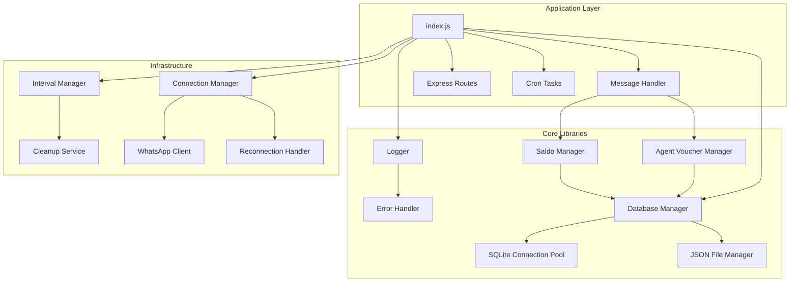

# Design Document: Comprehensive Debugging

## Overview

Dokumen ini menjelaskan desain teknis untuk memperbaiki bug dan meningkatkan stabilitas sistem RAF Bot V2. Perbaikan mencakup error logging, database connection management, memory leak prevention, input validation, test infrastructure, cron task reliability, WhatsApp connection resilience, dan JSON file locking.

## Architecture



## Components and Interfaces

### 1. Enhanced Logger Module

```javascript
// lib/logger.js - Enhanced error serialization

/**
 * Serialize error object for logging
 * @param {Error|any} error - Error to serialize
 * @returns {Object} Serialized error
 */
function serializeError(error) {
    if (error instanceof Error) {
        return {
            name: error.name,
            message: error.message,
            stack: error.stack,
            code: error.code,
            ...Object.getOwnPropertyNames(error).reduce((acc, key) => {
                if (!['name', 'message', 'stack'].includes(key)) {
                    acc[key] = error[key];
                }
                return acc;
            }, {})
        };
    }
    return error;
}
```

### 2. Interval Manager

```javascript
// lib/interval-manager.js - New module

class IntervalManager {
    constructor() {
        this.intervals = new Map();
        this.timeouts = new Map();
    }
    
    setInterval(name, callback, delay) {
        if (this.intervals.has(name)) {
            clearInterval(this.intervals.get(name));
        }
        const id = setInterval(callback, delay);
        this.intervals.set(name, id);
        return id;
    }
    
    clearAll() {
        for (const [name, id] of this.intervals) {
            clearInterval(id);
        }
        this.intervals.clear();
        
        for (const [name, id] of this.timeouts) {
            clearTimeout(id);
        }
        this.timeouts.clear();
    }
}

module.exports = new IntervalManager();
```

### 3. Database Connection Manager

```javascript
// lib/database-connection-manager.js - New module

class DatabaseConnectionManager {
    constructor() {
        this.connections = new Map();
        this.busyTimeout = 5000;
    }
    
    getConnection(dbPath) {
        if (!this.connections.has(dbPath)) {
            const db = new sqlite3.Database(dbPath);
            db.configure('busyTimeout', this.busyTimeout);
            this.connections.set(dbPath, db);
        }
        return this.connections.get(dbPath);
    }
    
    async closeAll() {
        const closePromises = [];
        for (const [path, db] of this.connections) {
            closePromises.push(new Promise((resolve, reject) => {
                db.close((err) => {
                    if (err) reject(err);
                    else resolve();
                });
            }));
        }
        await Promise.all(closePromises);
        this.connections.clear();
    }
}
```

### 4. Input Validator

```javascript
// lib/input-validator.js - New module

const validators = {
    phoneNumber: (value) => {
        if (!value) return { valid: false, message: 'Phone number is required' };
        const cleaned = value.replace(/\D/g, '');
        if (cleaned.length < 10 || cleaned.length > 15) {
            return { valid: false, message: 'Invalid phone number length' };
        }
        return { valid: true, value: cleaned };
    },
    
    amount: (value) => {
        const num = parseInt(value);
        if (isNaN(num) || num <= 0) {
            return { valid: false, message: 'Amount must be a positive number' };
        }
        if (num > Number.MAX_SAFE_INTEGER) {
            return { valid: false, message: 'Amount exceeds maximum allowed value' };
        }
        return { valid: true, value: num };
    },
    
    jid: (value) => {
        if (!value) return { valid: false, message: 'JID is required' };
        let normalized = value;
        if (normalized.includes(':')) {
            normalized = normalized.split(':')[0];
        }
        if (!normalized.endsWith('@s.whatsapp.net') && !normalized.endsWith('@lid')) {
            normalized = normalized + '@s.whatsapp.net';
        }
        return { valid: true, value: normalized };
    }
};

module.exports = validators;
```

## Data Models

### Interval Registry

```javascript
{
    name: String,           // Unique identifier for the interval
    intervalId: Number,     // Node.js interval ID
    callback: Function,     // Function to execute
    delay: Number,          // Delay in milliseconds
    createdAt: Date,        // When the interval was created
    lastRun: Date           // Last execution time
}
```

### Database Connection Pool Entry

```javascript
{
    path: String,           // Database file path
    connection: Object,     // SQLite database connection
    busyTimeout: Number,    // Busy timeout in milliseconds
    lastUsed: Date,         // Last usage timestamp
    queryCount: Number      // Number of queries executed
}
```


## Correctness Properties

*A property is a characteristic or behavior that should hold true across all valid executions of a system-essentially, a formal statement about what the system should do. Properties serve as the bridge between human-readable specifications and machine-verifiable correctness guarantees.*

### Property 1: Error Serialization Completeness

*For any* Error object with message, stack, and custom properties, serializing it using the Logger SHALL produce an object containing all original properties.

**Validates: Requirements 1.1**

### Property 2: Singleton Database Connection

*For any* sequence of database operations on the same database file, the Saldo_Manager SHALL use exactly one database connection instance.

**Validates: Requirements 2.1**

### Property 3: Database Retry with Backoff

*For any* database operation that fails with SQLITE_BUSY or file lock contention, the system SHALL retry with increasing delays up to a maximum number of attempts.

**Validates: Requirements 2.2, 8.2**

### Property 4: Interval Tracking

*For any* setInterval call registered through the IntervalManager, the interval reference SHALL be stored and clearable on shutdown.

**Validates: Requirements 3.1, 3.3**

### Property 5: Input Validation Consistency

*For any* user input (phone number, amount, or JID), the validator SHALL return a consistent result object with valid flag and either normalized value or error message.

**Validates: Requirements 4.1, 4.2, 4.3, 4.4**

### Property 6: Cron Expression Validation

*For any* cron expression string, the Cron_Task SHALL correctly identify valid expressions and reject invalid ones before scheduling.

**Validates: Requirements 6.1, 6.3**

### Property 7: WhatsApp Reconnection Backoff

*For any* WhatsApp disconnection event, the system SHALL attempt reconnection with exponentially increasing delays.

**Validates: Requirements 7.1**

### Property 8: File Lock Acquisition and Release

*For any* JSON file write operation, the Database_Manager SHALL acquire a lock before writing and release it after completion (including on error).

**Validates: Requirements 8.1, 8.4**

## Error Handling

### Error Categories

1. **Database Errors**
   - SQLITE_BUSY: Retry with exponential backoff (100ms, 200ms, 400ms, 800ms, 1600ms)
   - SQLITE_CONSTRAINT: Log and return user-friendly message
   - Connection errors: Attempt reconnection, alert if persistent

2. **Input Validation Errors**
   - Return structured error with field name and validation message
   - Log validation failures for monitoring

3. **WhatsApp Errors**
   - Connection lost: Automatic reconnection with backoff
   - Message send failure: Retry up to 3 times
   - Session expired: Alert admin, require re-scan

4. **File System Errors**
   - Lock contention: Retry with backoff
   - Corruption: Backup and reinitialize
   - Permission denied: Log and alert

### Error Response Format

```javascript
{
    success: false,
    error: {
        code: 'ERROR_CODE',
        message: 'User-friendly message',
        details: {} // Only in development
    }
}
```

## Testing Strategy

### Unit Tests

Unit tests akan dibuat untuk setiap modul inti:

1. **lib/logger.js** - Test error serialization
2. **lib/interval-manager.js** - Test interval tracking and cleanup
3. **lib/database-connection-manager.js** - Test connection pooling
4. **lib/input-validator.js** - Test all validators
5. **lib/saldo-manager.js** - Test saldo operations
6. **lib/cron.js** - Test cron expression validation

### Property-Based Tests

Property-based tests menggunakan **fast-check** library untuk JavaScript:

1. **Error Serialization** - Generate random Error objects, verify serialization
2. **Input Validation** - Generate random inputs, verify consistent validation
3. **Interval Management** - Generate random interval operations, verify tracking
4. **Database Operations** - Generate random operations, verify singleton pattern

### Test Configuration

```javascript
// jest.config.js
module.exports = {
    testEnvironment: 'node',
    testMatch: ['**/test/**/*.test.js'],
    setupFilesAfterEnv: ['./test/setup.js'],
    collectCoverageFrom: ['lib/**/*.js'],
    coverageThreshold: {
        global: {
            branches: 70,
            functions: 70,
            lines: 70
        }
    }
};
```

### Test Database Isolation

```javascript
// test/setup.js
process.env.NODE_ENV = 'test';
process.env.DATABASE_PATH = './database/test/';
```
