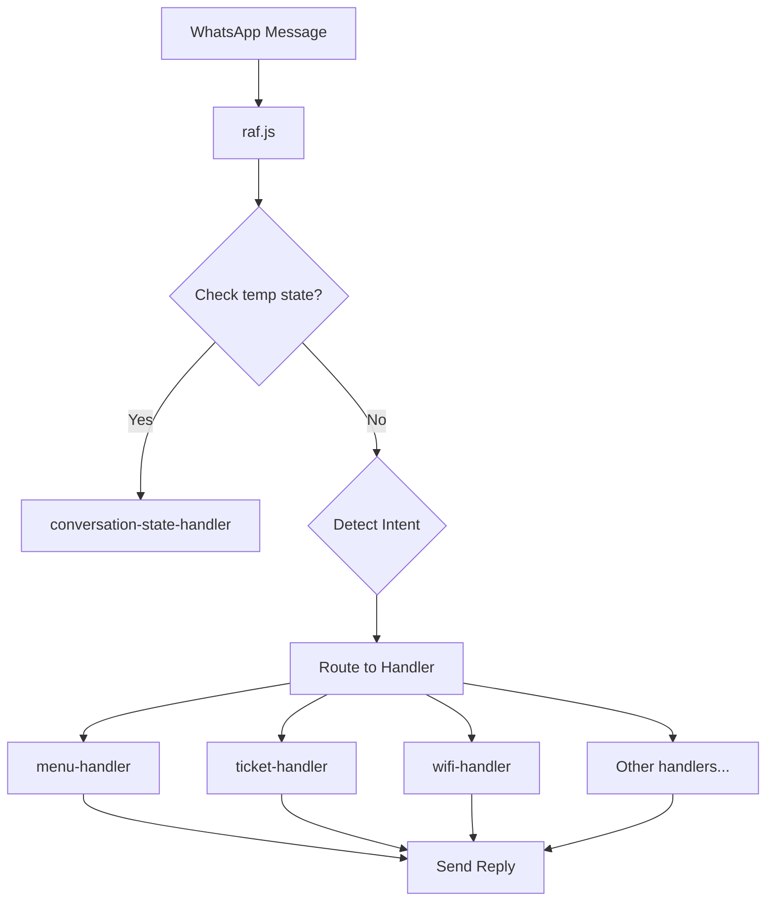

# 🤖 AI MAINTENANCE & FEATURE GUIDE - V3.0 COMPLETE SYSTEM ARCHITECTURE

## ⚠️ CRITICAL: MUST READ BEFORE ANY CHANGES

This guide provides a complete architectural overview of the RAF Bot V2 system, including backend, frontend, WhatsApp bot logic, and database structures.

**IMPORTANT FILES TO READ:**
1. This file (AI_MAINTENANCE_GUIDE.md)
2. AI_REFACTORING_RULES.md
3. WORKFLOW_DOCUMENTATION.md
4. REFACTORING_SUMMARY.md
5. routes/README.md

## 📊 SYSTEM OVERVIEW (November 2025)

```
Project: RAF Bot V2 - ISP Management & WhatsApp Support Bot
Tech Stack: Node.js + Express + WhatsApp (Baileys) + SQLite + PHP
Architecture: Monolithic with Modular Handlers
Status: Production Ready

✅ Refactoring Complete: Phase 1, 2, and 3
✅ Main File: 1,866 lines (reduced from 3,093)
✅ Total Handlers: 43 files
✅ Total Routes: 19 modules
✅ Zero axios calls in main file
```

### System Components:
- **Backend API**: Express.js REST API (Port 3100)
- **Frontend**: PHP Admin Dashboard (PHP-Express Engine)
- **WhatsApp Bot**: Multi-device support via Baileys
- **Database**: Hybrid (SQLite + JSON files)
- **External Services**: GenieACS, MikroTik API, iPaymu

## 📁 PROJECT STRUCTURE - UPDATED

## 🏗️ COMPLETE SYSTEM ARCHITECTURE

### 1. ENTRY POINT & SERVER INITIALIZATION

```
index.js (559 lines)
├── Express Server Setup
│   ├── Middleware Configuration
│   │   ├── CORS, Body Parser, Cookie Parser
│   │   ├── Static File Serving (/static, /img, /css, /js)
│   │   └── JWT Authentication Middleware
│   ├── Route Mounting (19 modules)
│   ├── PHP View Engine (php-express)
│   └── WebSocket (Socket.IO)
├── WhatsApp Connection (Baileys)
├── Global Variables & Services
│   └── Error Recovery, Monitoring, Alert System
└── Process Management (SIGTERM, SIGINT)
```

### 2. BACKEND ROUTES (395KB total)

```
routes/
├── Core Auth & Users
│   ├── public.js (51KB) - Login/logout
│   ├── accounts.js (9KB) - Admin/teknisi
│   ├── users.js (5KB) - Customers
│   └── agents.js (4KB) - Agent system
├── Admin & Operations  
│   ├── admin.js (127KB) - Main admin
│   ├── packages.js (6KB) - Internet packages
│   └── api.js (29KB) - General APIs
├── Financial
│   ├── saldo.js (21KB) - Balance
│   ├── invoice.js (24KB) - Invoices
│   └── compensation.js (38KB) - Compensations
├── Ticketing
│   ├── tickets.js (19KB) - Tickets
│   └── requests.js (33KB) - Requests
└── Monitoring
    └── monitoring-*.js - Dashboard & APIs
```

### 3. WHATSAPP BOT HANDLERS (43 files)

```
message/
├── raf.js (2023 lines) - Main Router
└── handlers/
    ├── Core: menu, utility, monitoring
    ├── WiFi: management, check, power, history, logger, reboot
    ├── Financial: payment, balance, billing, saldo, topup, speed-payment
    ├── Ticketing: creation, process, smart-report (3 variants), teknisi-workflow
    ├── Network: network, voucher, package, access management
    ├── Photo/Location: teknisi-photo-v3, upload-queue, workflow, customer-photo, location
    ├── States: conversation-state + 4 state handlers
    └── Support: admin, customer, agent, speed-boost, utils
```

### 4. DATABASE ARCHITECTURE

```
Hybrid System:
├── SQLite (database.sqlite)
│   └── users table: id, name, phone_number, address, device_id, subscription, paid
└── JSON Files (45+ files)
    ├── Core: accounts, packages, reports, config
    ├── Financial: payment, invoices, saldo_transactions, topup_requests
    ├── Network: mikrotik_devices, pppoe, statik, voucher
    ├── Requests: requests, compensations, speed_requests, package_changes
    ├── Templates: wifi_templates, message_templates, response_templates
    └── Locations: 23 location JSON files
```

### 5. FRONTEND STRUCTURE

```
views/
├── PHP APIs (12 files) - Monitoring, stats, health
├── MikroTik Integration (7 files) - RouterOS API
└── sb-admin/ (93 files)
    ├── Dashboard: index.php, monitoring
    ├── Users: users.php, accounts.php, agents.php
    ├── Financial: pembayaran/, topup, saldo, transactions
    ├── Tickets: tickets.php, compensation, requests
    ├── Network: wifi-management, packages, speed-boost
    └── System: settings, cron, backup, api-keys
```

### 6. LIBRARY MODULES (56 files)

```
lib/
├── Core: database, auth, security, logger, error-handler
├── Recovery: error-recovery, monitoring-service, alert-system, metrics
├── WhatsApp: message-helper, message-manager, templating, otp
├── WiFi: wifi (35KB), wifi-logger, wifi_template_handler
├── Financial: saldo-manager (21KB), payment, ipaymu, invoice-generator
├── Network: mikrotik, mikrotik-cache, device-status
├── Agents: agent-manager, transaction-manager, approval-logic
└── Utils: phone-validator, id-generator, cron (38KB), upload-helper
```

### 7. KEY NPM DEPENDENCIES

```json
{
  "@whiskeysockets/baileys": "^6.6.0",  // WhatsApp
  "express": "^4.17.1",                  // Web server
  "sqlite3": "^5.1.7",                   // Database
  "php-express": "^0.0.3",               // PHP views
  "socket.io": "^4.7.4",                 // WebSocket
  "axios": "^1.11.0",                    // HTTP client
  "jsonwebtoken": "^9.0.2",              // JWT auth
  "node-cron": "^3.0.3",                 // Scheduled tasks
  "rupiah-format": "^1.0.0",             // Currency format
  "qrcode": "^1.5.3",                    // QR generation
  "puppeteer": "^24.20.0",               // Browser automation
  "multer": "^2.0.2"                     // File uploads
}
```

## 🔄 MESSAGE FLOW ARCHITECTURE



## 📋 ADDING NEW FEATURES

### Step 1: Determine Feature Type

| Feature Type | Handler File | Example |
|-------------|-------------|---------|
| Menu/Display | menu-handler.js | New menu option |
| WiFi Operation | wifi-management-handler.js | Change WiFi settings |
| WiFi Power | wifi-power-handler.js | Power adjustments |
| Ticket/Report | smart-report-handler.js | New ticket type |
| Payment | payment-processor-handler.js | New payment method |
| Balance Ops | balance-management-handler.js | Topup, transfer |
| Billing | billing-management-handler.js | Invoice, bills |
| Package | package-management-handler.js | Speed boost, SOD |
| Network Admin | network-management-handler.js | IP binding, PPPoE |
| Voucher | voucher-management-handler.js | Profile management |
| Teknisi Flow | teknisi-workflow-handler.js | Technician steps |
| Multi-step | conversation-state-handler.js | Wizard/dialog |

### Step 2: Check Existing Patterns

```javascript
// Pattern 1: Simple Command
case 'COMMAND_NAME': {
    const { handleFunction } = require('./handlers/appropriate-handler');
    handleFunction({ sender, reply, /* params */ });
    break;
}

// Pattern 2: Multi-step Conversation
if (temp[sender]) {
    const { handleConversationState } = require('./handlers/conversation-state-handler');
    return handleConversationState({ sender, chats, temp, reply });
}

// Pattern 3: Admin Command
case 'ADMIN_COMMAND': {
    if (!isOwner) throw mess.owner;
    const { handleAdminFunction } = require('./handlers/admin-operations-handler');
    handleAdminFunction({ /* params */ });
    break;
}
```

### Step 3: Add to Appropriate Handler

```javascript
// In handler file:
function handleNewFeature({ sender, reply, global, /* other params */ }) {
    // Implement feature logic
    try {
        // Do something
        reply("Success message");
    } catch (error) {
        console.error('[NEW_FEATURE_ERROR]', error);
        reply("Error message");
    }
}

// Export the function
module.exports = {
    existingFunction1,
    existingFunction2,
    handleNewFeature  // Add here
};
```

### Step 4: Add Intent Mapping

```javascript
// In raf.js staticIntents object:
const staticIntents = {
    // ... existing mappings
    'new command': 'NEW_FEATURE',
    'alias command': 'NEW_FEATURE'
};

// In switch statement:
case 'NEW_FEATURE': {
    const { handleNewFeature } = require('./handlers/appropriate-handler');
    handleNewFeature({ /* params */ });
    break;
}
```

## 🐛 FIXING BUGS

### Debug Checklist:
1. Check error logs in console
2. Verify handler imports are correct
3. Check parameter passing
4. Verify database operations
5. Test with actual WhatsApp messages

### Common Issues:

| Issue | Likely Cause | Solution |
|-------|-------------|----------|
| Handler not found | Missing export | Add to module.exports |
| undefined error | Missing parameter | Check parameter passing |
| Database error | SQLite issue | Check lib/database.js |
| Message not sent | Wrong JID format | Check sender format |
| Command not recognized | Missing intent mapping | Add to staticIntents |
| Module not found | Wrong import path | Check if NPM package or local file |
| convertRupiah error | Wrong import | Use `require('rupiah-format')` not lib/function |
| User not detected | users/accounts undefined | Add `const users = global.users` at start |
| Cannot read properties of undefined | Missing global vars | Define from global: users, accounts, config |
| Commands not working | User stuck in state | Check global command detection before state handlers |
| "cek wifi" not working but "cekwifi" does | State intercepting | Ensure isGlobalCommand check comes first |

## 🔍 FINDING CODE

### By Feature:
- **Menus**: `handlers/menu-handler.js`
- **WiFi**: `handlers/wifi-*.js`
- **Tickets**: `handlers/ticket-*.js`, `handlers/teknisi-*.js`
- **Payments**: `handlers/payment-*.js`, `handlers/saldo-*.js`
- **Admin**: `handlers/admin-*.js`, `handlers/monitoring-*.js`

### By Flow:
- **Single Command**: Check specific handler
- **Multi-step**: `handlers/conversation-state-handler.js`
- **Background Process**: Check `lib/` folder

## 📊 DATABASE OPERATIONS

### User Data (SQLite):
```javascript
// Get user
const user = global.users.find(u => u.phone_number.includes(phone));

// Update user
db.run(`UPDATE users SET field = ? WHERE id = ?`, [value, userId]);

// Add user
db.run(`INSERT INTO users (name, phone_number, ...) VALUES (?, ?, ...)`, [...]);
```

### Temporary Data (in-memory):
```javascript
// Set conversation state
temp[sender] = { step: 'STEP_NAME', data: {} };

// Check state
if (temp[sender] && temp[sender].step === 'STEP_NAME') { /* ... */ }

// Clear state
delete temp[sender];
```

### Reports/Tickets (JSON file):
```javascript
// Add report
global.reports.push(newReport);
saveReportsToFile(global.reports);

// Find report
const report = global.reports.find(r => r.ticketId === id);

// Update report
report.status = 'new_status';
saveReportsToFile(global.reports);
```

## ⚠️ CRITICAL RULES

### NEVER:
1. ❌ Modify raf.js without updating handler
2. ❌ Add business logic to raf.js
3. ❌ Create duplicate handlers
4. ❌ Forget to export functions
5. ❌ Break existing functionality
6. ❌ Mix concerns in one handler
7. ❌ Ignore error handling
8. ❌ Add unnecessary confirmations for non-destructive operations
9. ❌ Let global commands interrupt input states
10. ❌ Create complex state machines for simple tasks

### ALWAYS:
1. ✅ Read this guide first
2. ✅ Check if handler exists
3. ✅ Follow existing patterns
4. ✅ Test after changes
5. ✅ Update documentation
6. ✅ Handle errors properly
7. ✅ Pass all needed parameters
8. ✅ Execute immediately when parameters complete
9. ✅ Treat user input as data in input states, not commands
10. ✅ Keep operations simple and direct

## 🧪 TESTING

### Test Commands:
```bash
# Test specific handler
node test/test-[handler-name].js

# Test all handlers
node test/test-refactor-handlers.js

# Test specific feature
node test/test-[feature-name].js
```

### Test Pattern:
```javascript
// Create test file: test/test-new-feature.js
console.log('Testing New Feature...');

// Mock dependencies
const mockReply = (text) => console.log('Reply:', text);
const mockGlobal = { users: [], config: {} };

// Import handler
const { handleNewFeature } = require('../message/handlers/appropriate-handler');

// Test
handleNewFeature({
    sender: '628xxx@s.whatsapp.net',
    reply: mockReply,
    global: mockGlobal
});

console.log('Test complete!');
```

## 📝 DOCUMENTATION TO UPDATE

After adding/modifying features:

1. **This file** (AI_MAINTENANCE_GUIDE.md)
2. **REFACTORING_WORKFLOW.md** - If structure changes
3. **Handler file** - Add JSDoc comments
4. **Test file** - Create/update tests
5. **README.md** - If user-facing changes

## 🚀 DEPLOYMENT CHECKLIST

Before deploying changes:
- [ ] All handlers tested
- [ ] No console errors
- [ ] Database migrations done
- [ ] Documentation updated
- [ ] Backup created
- [ ] Test in staging environment

## 💡 QUICK REFERENCE

### Common Imports:
```javascript
// Handler imports
const { handleFunction } = require('./handlers/handler-name');

// Library imports
const { initializeDatabase } = require('../lib/database');
const { getSSIDInfo, setSSIDName } = require('../lib/wifi');
const { logWifiChange } = require('../lib/wifi-logger');
const saldoManager = require('../lib/saldo-manager');
const { logger } = require('../lib/logger');

// NPM package imports
const axios = require('axios');
const convertRupiah = require('rupiah-format'); // NOT from lib/function!
const moment = require('moment-timezone');
const fs = require('fs-extra');
```

### Common Variables:
```javascript
sender      // WhatsApp JID (628xxx@s.whatsapp.net)
pushname    // WhatsApp display name
isOwner     // Boolean: is owner
isTeknisi   // Boolean: is technician
global      // Global object with users, config, etc
temp        // Temporary conversation state

// CRITICAL: Always define from global at start of module.exports
const users = global.users || [];       // User database from SQLite
const accounts = global.accounts || []; // Technician accounts from JSON
reply       // Function to send message
chats       // Message content
q           // Message after command
args        // Message split by space
```

### Response Patterns:
```javascript
// Simple text
reply("Message");

// With formatting
reply(`*Bold* _italic_ ~strike~`);

// With variables
reply(`Hello ${pushname}, your ID is ${userId}`);

// Error handling
reply(mess.userNotRegister);
reply(mess.owner);
reply(mess.teknisiOrOwnerOnly);
```

## 🆕 POST-REFACTORING KEY PATTERNS

### Multi-Phone Notification Pattern
```javascript
// MUST send to ALL phone numbers:
// 1. Main customer
await global.raf.sendMessage(customerJid, { text: message });

// 2. All additional numbers
if (ticket.pelangganPhone) {
    const phones = ticket.pelangganPhone.split('|');
    for (const phone of phones) {
        const phoneJid = formatPhoneJid(phone);
        if (phoneJid !== customerJid) {
            await global.raf.sendMessage(phoneJid, { text: message });
        }
    }
}
```

### User Lookup Pattern
```javascript
// Find user with multiple phone formats
const user = global.users.find(u =>
    u.phone_number &&
    u.phone_number.split('|').some(num =>
        num.trim() === plainSenderNumber ||
        `62${num.trim().substring(1)}` === plainSenderNumber
    )
);
```

### Conversation State Pattern
```javascript
// Set state for multi-step
temp[sender] = {
    step: 'STATE_NAME',
    data: additionalData
};

// Check in raf.js
if (temp[sender]) {
    // Route to conversation-state-handler
}
```

## 🔧 HANDLER PATTERNS

### Admin/Teknisi vs Regular Users:
```javascript
// CRITICAL: Admin/teknisi are in accounts, NOT users
if (isOwner || isTeknisi) {
    // Must specify customer ID or name
    if (!providedId && !searchName) {
        // Show helpful guide, NOT error
        return reply("📋 Format: cek wifi [ID/nama]");
    }
} else {
    // Regular users check their own data
    user = users.find(v => v.phone_number.includes(plainSenderNumber));
}
```

### State Management:
```javascript
// Setting state for multi-step flows
temp[sender] = {
    step: 'STATE_NAME',
    data: additionalData
};

// Clearing state
delete temp[sender];

// CRITICAL: Global commands must break out of states
const keywordCheck = getIntentFromKeywords(chats);
const isGlobalCommand = keywordCheck !== null || ['menu','help'].includes(command);

// Clear states for global commands
if (isGlobalCommand && temp[sender]) {
    delete temp[sender];
}
```

## 🔍 DEBUGGING GUIDE FOR REFACTORED CODE

| Problem | Check Handler | Solution |
|---------|---------------|----------|
| WiFi name not changing | wifi-management-handler.js | Check GenieACS connection |
| OTP not showing | teknisi-workflow-handler.js | Verify ticket.otp exists |
| Notifications missing | Any handler with notifications | Check multi-phone pattern |
| State not working | conversation-state-handler.js | Check temp[sender] object |
| Balance errors | balance-management-handler.js | Check ATM functions |
| Photo upload stuck | teknisi-photo-handler-v3.js | Check queue processing |
| Names show as "Customer" | Check database | Verify users table has data |
| Package change fails | package-management-handler.js | Check global.packages |
| Speed boost not working | package-management-handler.js | Check global.sod pricing |
| IP binding errors | network-management-handler.js | Check MikroTik connection |
| Log shows "[object Object]" | wifi-name-state-handler.js | Use .find() to get specific SSID from array |
| Wrong restart message | wifi-name-state-handler.js | Name change no restart, password change yes |
| Missing SSID details in log | All WiFi handlers | Include SSID ID in reason/notes |
| Password not logged | wifi-password-state-handler.js | Add logWifiChange after setPassword |
| History WiFi not working | wifi-history-handler.js | Check getWifiChangeLogs function |
| Wrong getSSIDInfo params | wifi-name-state-handler.js | Only pass deviceId, no second param |

## 🚨 TROUBLESHOOTING GUIDE

### Step-by-Step Diagnostic Process:

#### 1. **First Response to Any Issue:**
```bash
# Run comprehensive health check
node tools/system-health-check.js --full

# Check the generated report
cat health-check-report.json
```

#### 2. **Common WiFi Issues:**

**Problem: "[object Object]" in logs**
```javascript
// CHECK: wifi-name-state-handler.js Line 119
// Should be: await getSSIDInfo(deviceId) 
// NOT: await getSSIDInfo(deviceId, ssidId)

// CHECK: How you access SSID data
// WRONG: oldName = oldInfo.ssid;
// RIGHT: const targetSsid = oldInfo.ssid.find(s => s.id === targetId);
//        oldName = targetSsid?.name || 'Unknown';
```

**Problem: Password changes not logged**
```javascript
// CHECK: wifi-password-state-handler.js
// Should have: const { logWifiChange } = require('../../../lib/wifi-logger');
// Should call: await logWifiChange({...}) after setPassword
```

**Problem: History WiFi error**
```javascript
// CHECK: wifi-history-handler.js
// getWifiChangeLogs returns: {logs: [], total: 0}
// Extract: const result = await getWifiChangeLogs();
//          const logs = result.logs || [];
```

#### 3. **Database Issues:**

**Problem: User not found**
```bash
# Check if user exists
node test/test-sqlite-users.js

# Check phone format (needs 62 prefix)
# Database: "6285233047094"
# WhatsApp: "6285233047094@s.whatsapp.net"
```

**Problem: Names showing as "Customer"**
```javascript
// CHECK: Use correct field
// RIGHT: user.name || user.username || 'Customer'
// WRONG: user.full_name (doesn't exist)
```

#### 4. **Import/Module Issues:**

**Problem: Cannot find module**
```javascript
// Common fixes:
// lib/function → require('rupiah-format')
// lib/moment → require('moment-timezone')
// Check package.json for NPM packages
```

#### 5. **State Handler Issues:**

**Problem: Cancel (batal) not working**
```javascript
// CHECK: conversation-state-handler.js
// Must have case for every state used in handlers
// Example: ASK_NEW_NAME_FOR_SINGLE, CONFIRM_GANTI_NAMA
```

### Quick Fix Commands:

```bash
# Generate detailed prompt from simple one
node tools/prompt-generator.js "fix wifi log"

# Interactive command center
node tools/command-center.js

# Check WiFi subsystem only
node tools/system-health-check.js --wifi

# Check database only
node tools/system-health-check.js --db
```

### Emergency Fixes:

#### Reset WiFi Logs:
```bash
echo "[]" > database/wifi_change_logs.json
```

#### Backup Database:
```bash
cp database.sqlite backups/database_$(date +%Y%m%d_%H%M%S).sqlite
```

#### Clear Corrupted State:
```javascript
// In raf.js, add temporary:
delete temp[sender];
deleteUserState(sender);
```

## 🔄 WIFI DUAL-MODE SYSTEM

### Configuration: `custom_wifi_modification`
Located in `config.json` line 140, controls WiFi modification behavior:

#### **Mode 1: TRUE (Guided Mode)**
- Shows SSID selection menus
- Asks confirmations before execution
- Step-by-step guidance
- Best for non-technical users

#### **Mode 2: FALSE (Direct Mode)**
- Direct execution without confirmations
- Auto-applies to all SSIDs
- Minimal interaction steps
- Best for technical users

### Implementation Pattern:
```javascript
// Always check config before execution
if (global.config.custom_wifi_modification) {
    // Set confirmation state
    temp[sender] = { step: 'CONFIRM_GANTI_NAMA', ... };
    reply('Konfirmasi: ...');
} else {
    // Direct execution
    await executeChange();
    reply('✅ Berhasil!');
}
```

### State Interception Protection:
WiFi input states are protected from global commands:
- `ASK_NEW_NAME_*` states
- `ASK_NEW_PASSWORD_*` states
- Only "batal" can break out
- Common words like "hai", "menu" work as WiFi names

### WiFi Data Structures:

#### getSSIDInfo Return Format:
```javascript
{
  deviceId: "00259E-HG8145V5-...",
  ssid: [  // ARRAY of SSID objects
    { 
      id: "1", 
      name: "MyWiFi",
      transmitPower: 100,
      associatedDevices: []
    }
  ]
}
```

#### Correct Pattern for Fetching Names:
```javascript
// WRONG - assigns entire array
oldName = oldInfo.ssid;  // ❌ Results in [object Object]

// CORRECT - find specific SSID
const targetSsid = oldInfo.ssid.find(s => s.id === targetId);
oldName = targetSsid?.name || 'Unknown';  // ✅
```

### WiFi Change Behavior:
| Change Type | Modem Restart? | User Action |
|------------|---------------|-------------|
| Name Change | ❌ NO | Reconnect with new name, same password |
| Password Change | ✅ YES | Wait for restart, reconnect with new password |

### WiFi Password Logging:
```javascript
// Passwords are visible in logs for monitoring (user requirement)
changes: {
    newPassword: actualPassword  // NOT '[PROTECTED]'
}
```

### WiFi History Feature:
- **Command:** "history wifi" or "riwayat wifi"
- **Shows:** Last 10 changes (both name and password)
- **Displays:** Actual passwords for reference
- **Handler:** wifi-history-handler.js

## 🔐 KEYWORD TEMPLATES (wifi_templates.json)

### Adding New Keywords:
```javascript
{
    "keywords": [
        "singleword",          // No space
        "two words",            // 2 words
        "three word phrase",    // 3 words
        "four or more words"    // 4+ words
    ],
    "intent": "YOUR_INTENT",
    "category": "wifi/billing/support",
    "description": "What it does",
    "icon": "📡"
}
```

### Keyword Matching Rules:
1. **Must be at START of message** - "cek wifi" ✅ but "tolong cek wifi" ❌
2. **Longest match wins** - "cek wifi saya" beats "cek wifi"
3. **Case insensitive** - "CeK WiFi" = "cek wifi"
4. **Additional text OK** - "cek wifi dong" matches "cek wifi"

## 🔧 MAINTENANCE TASKS

### Daily:
- Check error logs
- Monitor performance
- Verify bot responsiveness

### Weekly:
- Backup database
- Update dependencies
- Review pending tickets

### Monthly:
- Clean old logs
- Archive completed tickets
- Review handler performance

## 🔧 SYSTEM INTEGRATION POINTS

### External Services:
- **GenieACS**: Device management (TR-069 protocol)
- **MikroTik**: Network management (RouterOS API v6/v7)
- **iPaymu**: Payment gateway integration
- **WhatsApp**: Multi-device WebSocket (Baileys)

### Internal Communication:
- **Socket.IO**: Real-time dashboard updates
- **Global Variables**: Shared state across modules
- **Event System**: Process communication
- **File Watchers**: Template hot-reload

### Data Flow Examples:
```javascript
// User Registration Flow
SQLite INSERT → global.users.push() → WhatsApp notification

// Ticket Processing Flow
Customer report → smart-report-handler → reports.json → 
teknisi assignment → workflow states → completion → notifications

// Payment Flow
Request → iPaymu API → Webhook callback → Database update → Confirmation

// WiFi Change Flow
Command → wifi-handler → GenieACS API → Device update → Log → Response
```

## 🚀 CRITICAL SYSTEM PATTERNS

### Authentication:
```javascript
// JWT Token Structure
Admin/Teknisi: { id, username, role }
Customer: { id, name }
```

### Phone Number Format:
```javascript
// Database: "628xxx|628yyy" (multiple phones pipe-separated)
// WhatsApp: "628xxx@s.whatsapp.net"
// Always convert between formats
```

### Multi-Phone Notifications:
```javascript
// MUST send to ALL registered numbers
const phones = user.phone_number.split('|');
for (const phone of phones) {
  await sendMessage(formatJid(phone), message);
}
```

### State Management Priority:
1. Check global commands first (breaks states)
2. Check temp[sender] for conversations
3. Check smartReportState for reports
4. Process normal commands

### Error Recovery:
- Automatic retry with exponential backoff
- Circuit breaker for external services
- Graceful degradation
- Alert system for critical failures

## 📈 MONITORING & PERFORMANCE

### Key Metrics Tracked:
- Message processing latency
- API response times
- Database query performance
- External service availability
- Memory/CPU usage
- Active WhatsApp connections

### Health Check Endpoints:
- `/api/monitoring/health` - System health
- `/api/monitoring/metrics` - Performance metrics
- `/api/monitoring/services` - Service status
- `/api/system-health` - Comprehensive check

## 🔐 SECURITY ARCHITECTURE

### Authentication Layers:
- JWT tokens (24h expiration)
- Role-based access (owner/teknisi/customer/agent)
- IP whitelist for sensitive operations
- Rate limiting (100 req/min default)

### Data Protection:
- Input validation on all endpoints
- SQL injection prevention (parameterized queries)
- XSS protection (HTML escaping)
- CSRF tokens for forms
- File upload restrictions (.jpg/.png only)

### WhatsApp Security:
- End-to-end encryption (Baileys)
- Session management (multi-file auth)
- Message validation
- Sender verification
- Command authorization

---

**⚡ THIS GUIDE IS THE COMPLETE SYSTEM DOCUMENTATION**

*Last Updated: 2025-11-18*
*Version: 3.0 (Complete System Architecture)*
*Status: Production Documentation*

### Changelog:
- **v3.0 (2025-11-18)**: Complete system architecture documentation
  - Added full backend routes analysis
  - Added frontend structure mapping
  - Added database architecture details
  - Added system integration points
  - Added security architecture
- v2.3 (2025-11-05): WiFi features and logging
- v2.0 (2025-11-03): Post-refactoring structure
- v1.0: Initial documentation
