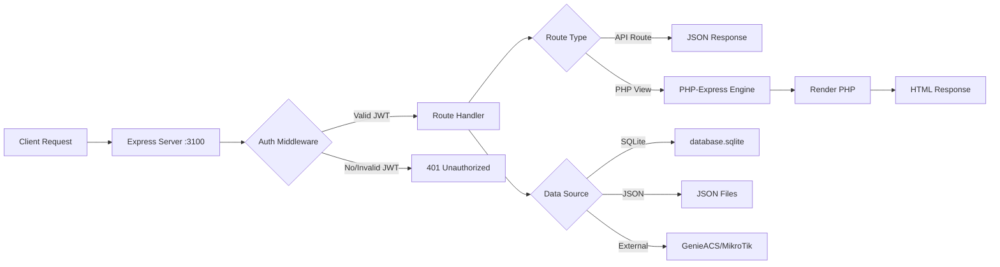

# 🤖 AI MAINTENANCE & FEATURE GUIDE - V3.0 COMPLETE SYSTEM ARCHITECTURE

## ⚠️ CRITICAL: MUST READ BEFORE ANY CHANGES

This guide provides a complete architectural overview of the RAF Bot V2 system, including backend, frontend, WhatsApp bot logic, and database structures.

**IMPORTANT FILES TO READ:**
1. This file (AI_MAINTENANCE_GUIDE_V3.md)
2. AI_REFACTORING_RULES.md
3. WORKFLOW_DOCUMENTATION.md
4. REFACTORING_SUMMARY.md
5. routes/README.md
6. BUGFIX_BROADCAST_AUTH.md (Critical auth issue)
7. MASS_FIX_FETCH_CREDENTIALS.md (Pending fixes)
8. BUGFIX_INDEX_SYNTAX_ERROR.md (JavaScript syntax fix)
9. BUGFIX_BROADCAST_PLACEHOLDER.md (Placeholder not working)
10. ANALYSIS_CRON_JOBS.md (Cron jobs complete audit)
11. FEATURE_CONFIGURABLE_DELAY.md (Configurable WhatsApp delay)
12. BUGFIX_CONFIG_SYNTAX_ERROR.md (Config page syntax fix)
13. BUGFIX_TEMPLATES_SYNTAX_ERROR.md (Templates page syntax fix)
14. BUGFIX_CRON_REMINDER_NOT_SENDING.md (Cron reminder day check)
15. BUGFIX_MASS_SYNTAX_ERRORS.md (5 admin pages syntax fix)
16. BUGFIX_USERS_EDIT_NOT_UPDATING.md (Users edit missing credentials - CRITICAL)
17. BUGFIX_USERS_PAID_STATUS_NOT_UPDATING.md (Paid checkbox FormData issue - CRITICAL)

## 📊 SYSTEM OVERVIEW (November 2025)

```
Project: RAF Bot V2 - ISP Management & WhatsApp Support Bot
Tech Stack: Node.js + Express + WhatsApp (Baileys) + SQLite + PHP
Architecture: Monolithic with Modular Handlers
Status: Production Ready
```

### System Components:
- **Backend API**: Express.js REST API (Port 3100)
- **Frontend**: PHP Admin Dashboard (PHP-Express Engine)
- **WhatsApp Bot**: Multi-device support via Baileys
- **Database**: Hybrid (SQLite + JSON files)
- **External Services**: GenieACS, MikroTik API, iPaymu

## 🏗️ COMPLETE SYSTEM ARCHITECTURE

### 1. ENTRY POINT & SERVER INITIALIZATION

```
index.js (559 lines)
├── Express Server Setup
│   ├── Middleware Configuration
│   │   ├── CORS
│   │   ├── Body Parser (JSON/URL-encoded)
│   │   ├── Cookie Parser
│   │   ├── Static File Serving
│   │   └── Authentication Middleware (JWT)
│   │
│   ├── Route Mounting (19 route modules)
│   │   ├── Public API Routes
│   │   ├── Admin API Routes
│   │   ├── User Management Routes
│   │   ├── Payment & Billing Routes
│   │   ├── Monitoring Routes
│   │   └── Ticket Management Routes
│   │
│   ├── PHP View Engine Setup
│   │   └── php-express integration
│   │
│   └── WebSocket (Socket.IO)
│       └── Real-time communication
│
├── WhatsApp Connection
│   ├── Baileys WebSocket
│   ├── Multi-file Auth State
│   ├── QR Code Generation
│   └── Message Handler Integration
│
├── Global Variables & Services
│   ├── Database Connections (global.db)
│   ├── WhatsApp Instance (global.sock)
│   ├── Socket.IO Instance (global.io)
│   ├── Error Recovery System
│   ├── Monitoring Service
│   └── Alert System
│
└── Process Management
    ├── Error Handlers (unhandledRejection, uncaughtException)
    ├── Graceful Shutdown (SIGTERM, SIGINT)
    └── Resource Cleanup
```

### 2. BACKEND ROUTES STRUCTURE

```
routes/ (19 modules, 395KB total)
├── Core Authentication & User Management
│   ├── public.js (51KB) - Login, logout, public APIs
│   ├── accounts.js (8.8KB) - Admin/teknisi accounts
│   ├── users.js (5KB) - Customer management
│   └── agents.js (4.3KB) - Agent system
│
├── Admin & Operations
│   ├── admin.js (127KB) - Main admin operations
│   ├── packages.js (5.6KB) - Internet packages
│   ├── pages.js (3KB) - Page routing
│   └── api.js (29KB) - General API endpoints
│
├── Financial & Billing
│   ├── saldo.js (20KB) - Balance management
│   ├── invoice.js (24KB) - Invoice generation
│   ├── payment-status.js (2.9KB) - Payment tracking
│   └── compensation.js (38KB) - Compensation system
│
├── Ticketing & Support
│   ├── tickets.js (18KB) - Ticket management
│   ├── requests.js (32KB) - Customer requests
│   └── stats.js (11KB) - Statistics
│
└── Monitoring
    ├── monitoring-dashboard.js (7.3KB)
    ├── monitoring-api.js (2.8KB)
    └── monitoring-dummy.js (3.6KB)
```

### 3. WHATSAPP BOT MESSAGE FLOW

```
message/
├── raf.js (2023 lines) - Main Router & Message Processor
│   ├── Message Reception
│   │   ├── Auth Check (owner/teknisi/customer)
│   │   ├── State Check (conversation/temp)
│   │   ├── Intent Detection (keywords/commands)
│   │   └── Handler Routing
│   │
│   ├── Static Intents Mapping
│   │   ├── Menu Commands
│   │   ├── WiFi Commands
│   │   ├── Ticket Commands
│   │   ├── Payment Commands
│   │   └── Admin Commands
│   │
│   └── Multi-Step Conversation Flow
│       ├── Temporary States (temp[sender])
│       ├── Smart Report States
│       └── Confirmation Dialogs
│
└── handlers/ (45 files)
    ├── Core Handlers
    │   ├── menu-handler.js - Menu displays
    │   ├── utility-handler.js - Helper functions
    │   └── monitoring-handler.js - Status monitoring
    │
    ├── WiFi Management
    │   ├── wifi-management-handler.js - Name/password changes
    │   ├── wifi-check-handler.js - Status checking
    │   ├── wifi-power-handler.js - Power control
    │   ├── wifi-history-handler.js - Change logs
    │   ├── wifi-logger.js - WiFi change tracking
    │   └── reboot-modem-handler.js - Router reboot
    │
    ├── Financial Handlers
    │   ├── payment-processor-handler.js - Payment processing
    │   ├── payment-handler.js - Payment operations
    │   ├── balance-management-handler.js - Top-up/transfer
    │   ├── billing-management-handler.js - Bill checking
    │   ├── saldo-handler.js - Saldo operations
    │   ├── saldo-voucher-handler.js - Voucher operations
    │   ├── topup-handler.js - Top-up processing
    │   └── speed-payment-handler.js - Speed boost payments
    │
    ├── Ticketing System
    │   ├── ticket-creation-handler.js - Create tickets
    │   ├── ticket-process-handler.js - Process tickets
    │   ├── smart-report-handler.js - Smart reporting
    │   ├── smart-report-text-menu.js - Menu-based reports
    │   ├── smart-report-hybrid.js - Hybrid reporting
    │   └── teknisi-workflow-handler.js - Technician workflow
    │
    ├── Network Management
    │   ├── network-management-handler.js - IP/PPPoE
    │   ├── voucher-management-handler.js - Voucher profiles
    │   ├── package-management-handler.js - Package changes
    │   └── access-management-handler.js - Access control
    │
    ├── Photo & Location
    │   ├── teknisi-photo-handler-v3.js - Photo uploads
    │   ├── photo-upload-queue.js - Upload queue
    │   ├── photo-workflow-handler.js - Photo workflow
    │   ├── customer-photo-handler.js - Customer photos
    │   └── simple-location-handler.js - Location tracking
    │
    ├── State Management
    │   ├── conversation-state-handler.js - Main state router
    │   ├── conversation-handler.js - User state management
    │   └── states/
    │       ├── wifi-name-state-handler.js
    │       ├── wifi-password-state-handler.js
    │       ├── report-state-handler.js
    │       └── other-state-handler.js
    │
    └── Support Handlers
        ├── admin-handler.js - Admin operations
        ├── customer-handler.js - Customer operations
        ├── agent.js - Agent system
        ├── speed-boost-handler.js - Speed boost
        ├── speed-status-handler.js - Speed status
        └── utils.js - Utility functions
```

### 4. DATABASE STRUCTURE

```
Database Architecture: Hybrid System
├── SQLite (database.sqlite - 143KB)
│   ├── users table (customers)
│   │   ├── id (INTEGER PRIMARY KEY)
│   │   ├── name (TEXT)
│   │   ├── phone_number (TEXT) - Format: "62xxx|62yyy"
│   │   ├── address (TEXT)
│   │   ├── device_id (TEXT)
│   │   ├── subscription (TEXT)
│   │   ├── paid (TEXT)
│   │   └── created_at (DATETIME)
│   │
│   └── monitoring_metrics.sqlite (49KB)
│       └── Performance metrics storage
│
└── JSON Files (database/)
    ├── Core Data
    │   ├── accounts.json - Admin/teknisi accounts
    │   ├── packages.json - Internet packages
    │   ├── reports.json - Ticket/report data
    │   └── config.json - System configuration
    │
    ├── Financial Data
    │   ├── payment.json - Payment records
    │   ├── payment-method.json - Payment methods
    │   ├── invoices.json - Invoice data
    │   ├── saldo_transactions.json - Balance transactions
    │   ├── topup_requests.json - Top-up requests
    │   └── voucher_purchases.json - Voucher purchases
    │
    ├── Network & Device Data
    │   ├── mikrotik_devices.json - MikroTik devices
    │   ├── network_assets.json - Network assets
    │   ├── pppoe.json - PPPoE configurations
    │   ├── statik.json - Static profiles
    │   └── voucher.json - Voucher profiles
    │
    ├── Agent & Reseller Data
    │   ├── agents.json - Agent profiles
    │   ├── agent_credentials.json - Agent credentials
    │   ├── agent_transactions.json - Agent transactions
    │   └── reseller.json - Reseller data
    │
    ├── Request & Tracking Data
    │   ├── requests.json - Customer requests
    │   ├── compensations.json - Compensation records
    │   ├── speed_requests.json - Speed boost requests
    │   ├── package_change_requests.json - Package changes
    │   └── wifi_change_logs.json - WiFi change history
    │
    ├── Template & Config Data
    │   ├── wifi_templates.json - WiFi command templates
    │   ├── wifi_menu_templates.json - WiFi menu templates
    │   ├── message_templates.json - Message templates
    │   ├── response_templates.json - Response templates
    │   ├── handler_messages.json - Handler messages
    │   └── commands.json - Command configurations
    │
    └── Location Data
        └── locations/ (23 location JSON files)
            └── [LOCATION_ID].json - Location coordinates
```

### 5. FRONTEND STRUCTURE

```
views/
├── PHP Views (Root Level)
│   ├── API Endpoints
│   │   ├── api-monitoring-wrapper.php - Monitoring API
│   │   ├── api-monitoring-live.php - Live monitoring
│   │   ├── api-system-health.php - System health
│   │   ├── api-traffic-stats.php - Traffic statistics
│   │   └── api-users-stats.php - User statistics
│   │
│   ├── MikroTik Integration
│   │   ├── routeros_api.class.php - RouterOS API v6
│   │   ├── routeros_api_v7.class.php - RouterOS API v7
│   │   ├── conn.php - Connection handler
│   │   ├── interface.php - Interface management
│   │   ├── resource.php - Resource monitoring
│   │   └── netwatch.php - Network watch
│   │
│   ├── User Management
│   │   ├── adduserhotspot.php - Add hotspot user
│   │   ├── adduserpppoe.php - Add PPPoE user
│   │   ├── addipbinding.php - IP binding
│   │   ├── addsimplequeue.php - Queue management
│   │   └── user-hotspot.php - Hotspot user list
│   │
│   └── Statistics & Monitoring
│       ├── get_hotspot_stats.php - Hotspot statistics
│       ├── get_ppp_stats.php - PPP statistics
│       ├── get_ppp_active.php - Active PPP users
│       └── monitoring-dashboard.html - Dashboard view
│
└── sb-admin/ (Admin Dashboard - 93 files)
    ├── Authentication & Access
    │   ├── login.php - Login page
    │   ├── logout.php - Logout handler
    │   └── 404.php - Error page
    │
    ├── Dashboard & Overview
    │   ├── index.php - Main dashboard
    │   ├── blank.php - Template page
    │   └── monitoring-dashboard.php - Monitoring view
    │
    ├── User Management
    │   ├── users.php - Customer management
    │   ├── accounts.php - Admin/teknisi accounts
    │   ├── agents.php - Agent management
    │   └── profile.php - User profile
    │
    ├── Financial Management
    │   ├── pembayaran/ - Payment subdirectory
    │   │   ├── index.php - Payment list
    │   │   ├── invoice.php - Invoice view
    │   │   └── payment-status.php - Payment status
    │   ├── topup.php - Top-up management
    │   ├── saldo.php - Balance management
    │   └── transactions.php - Transaction history
    │
    ├── Ticketing & Support
    │   ├── tickets.php - Ticket management
    │   ├── ticket-detail.php - Ticket details
    │   ├── compensation.php - Compensation management
    │   └── requests.php - Customer requests
    │
    ├── Network & WiFi Management
    │   ├── wifi-management.php - WiFi settings
    │   ├── wifi-templates.php - WiFi templates
    │   ├── wifi-logs.php - WiFi change logs
    │   ├── packages.php - Internet packages
    │   └── speed-boost.php - Speed boost management
    │
    ├── Reports & Analytics
    │   ├── reports.php - Report generation
    │   ├── statistics.php - Statistics view
    │   ├── traffic-analysis.php - Traffic analysis
    │   └── user-activity.php - User activity logs
    │
    └── System Configuration
        ├── settings.php - System settings
        ├── cron.php - Cron job management
        ├── backup.php - Backup management
        └── api-keys.php - API key management
```

### 6. LIBRARY MODULES

```
lib/ (56 modules)
├── Core System Libraries
│   ├── database.js - Database operations (SQLite + JSON)
│   ├── auth.js - Authentication helpers
│   ├── security.js - Security functions
│   ├── logger.js - Logging system
│   └── error-handler.js - Error handling
│
├── Recovery & Monitoring
│   ├── error-recovery.js - Error recovery system
│   ├── monitoring-service.js - Service monitoring
│   ├── alert-system.js - Alert management
│   ├── metrics.js - Performance metrics
│   └── rate-limiter.js - Rate limiting
│
├── WhatsApp & Messaging
│   ├── message-helper.js - Message utilities
│   ├── message-manager.js - Message management
│   ├── handler-messages.js - Handler messages
│   ├── templating.js - Template engine
│   └── otp.js - OTP generation
│
├── WiFi & Network Management
│   ├── wifi.js (35KB) - WiFi operations
│   ├── wifi-logger.js - WiFi change logging
│   ├── wifi-log-viewer.js - Log viewing
│   ├── wifi_template_handler.js - Template handler
│   ├── mikrotik.js - MikroTik API
│   ├── mikrotik-cache.js - MikroTik caching
│   └── device-status.js - Device status
│
├── Financial & Billing
│   ├── saldo-manager.js (20KB) - Balance management
│   ├── saldo.js - Balance operations
│   ├── payment.js - Payment processing
│   ├── ipaymu.js - iPaymu integration
│   ├── invoice-generator.js - Invoice generation
│   └── pdf-invoice-generator.js (26KB) - PDF invoices
│
├── Agent & Transaction Management
│   ├── agent-manager.js - Agent management
│   ├── agent-transaction-manager.js - Transactions
│   ├── approval-logic.js - Approval workflow
│   └── reseller.js - Reseller management
│
├── Voucher & Package Management
│   ├── voucher-manager.js - Voucher management
│   ├── voucher.js - Voucher operations
│   └── statik.js - Static profiles
│
├── Speed & Performance
│   ├── speed-boost-cleanup.js - Cleanup tasks
│   ├── speed-boost-matrix-helper.js - Matrix helper
│   ├── speed-request-helper.js - Request helper
│   └── working-hours-helper.js - Working hours
│
├── Utilities & Helpers
│   ├── myfunc.js - Common functions
│   ├── utils.js - Utility functions
│   ├── color.js - Console colors
│   ├── id-generator.js - ID generation
│   ├── password.js - Password utilities
│   ├── phone-validator.js - Phone validation
│   ├── phone-validator-international.js - Intl phones
│   ├── upload-helper.js - File uploads
│   ├── simple-tracking.js - Tracking
│   └── request-lock.js - Request locking
│
└── Scheduled Tasks & Maintenance
    ├── cron.js (37KB) - Cron job management
    ├── topup-expiry.js - Top-up expiration
    └── command-manager.js - Command management
```

## 🔄 COMPLETE MESSAGE FLOW ARCHITECTURE

### WhatsApp Message Processing Pipeline:

```mermaid
graph TD
    A[WhatsApp Message Received] --> B[index.js: msgHandler]
    B --> C[raf.js: Main Router]
    
    C --> D{Auth Check}
    D -->|Owner| E[isOwner = true]
    D -->|Teknisi| F[isTeknisi = true]
    D -->|Customer| G[Regular User]
    
    C --> H{State Check}
    H -->|Has temp[sender]| I[conversation-state-handler]
    H -->|Has smartReportState| J[Smart Report Flow]
    H -->|No State| K[Intent Detection]
    
    K --> L{Intent Source}
    L -->|Static Intent| M[staticIntents mapping]
    L -->|WiFi Template| N[wifi_templates.json]
    L -->|Direct Command| O[Command Switch]
    
    I --> P[State Handlers]
    P --> Q[wifi-name-state-handler]
    P --> R[wifi-password-state-handler]
    P --> S[report-state-handler]
    P --> T[other-state-handler]
    
    M --> U[Handler Routing]
    U --> V[menu-handler]
    U --> W[wifi-management-handler]
    U --> X[ticket-creation-handler]
    U --> Y[payment-processor-handler]
    U --> Z[Other Handlers...]
    
    V --> AA[Send Reply]
    W --> AA
    X --> AA
    Y --> AA
    Z --> AA
```

### API Request Flow:



## 🗂️ KEY CONFIGURATION FILES

### 1. Main Configuration (config.json)
```javascript
{
  "sessionName": "raf",
  "ownerNumber": ["628xxx"],
  "nama": "ISP Name",
  "namabot": "RAF Bot",
  "parentbinding": "ether5",
  "telfon": "628xxx",
  "custom_wifi_modification": false,  // WiFi dual-mode
  "apikey_genieacs": "xxx",
  "url_genieacs": "http://xxx",
  "token": "xxx",
  // ... other configs
}
```

### 2. WiFi Templates (wifi_templates.json)
```javascript
{
  "templates": [
    {
      "keywords": ["cek wifi", "cekwifi"],
      "intent": "CEK_WIFI",
      "category": "wifi",
      "description": "Check WiFi status"
    }
    // ... more templates
  ]
}
```

### 3. Package Dependencies (package.json)
```javascript
{
  "dependencies": {
    "@whiskeysockets/baileys": "^6.6.0",  // WhatsApp
    "express": "^4.17.1",                  // Web server
    "sqlite3": "^5.1.7",                   // Database
    "php-express": "^0.0.3",               // PHP engine
    "socket.io": "^4.7.4",                 // WebSocket
    "axios": "^1.11.0",                    // HTTP client
    "jsonwebtoken": "^9.0.2",              // JWT auth
    "node-cron": "^3.0.3",                 // Cron jobs
    "rupiah-format": "^1.0.0",             // Currency
    "qrcode": "^1.5.3",                    // QR codes
    "puppeteer": "^24.20.0"                // Browser automation
  }
}
```

## 📋 HANDLER CATEGORIZATION

### By Functionality:

| Category | Handlers | Purpose |
|----------|----------|---------|
| **Core** | menu, utility, monitoring | Basic operations |
| **WiFi** | wifi-*, reboot-modem | WiFi management |
| **Financial** | payment, balance, billing, saldo, topup | Money operations |
| **Ticketing** | ticket-*, smart-report-*, teknisi-* | Support tickets |
| **Network** | network, voucher, package, access | Network management |
| **Photo/Location** | photo-*, location-* | Media & location |
| **State** | conversation-*, *-state-* | Multi-step flows |
| **Admin** | admin, agent, customer | User management |

### By User Type:

| User Type | Available Features |
|-----------|-------------------|
| **Owner** | All features + admin commands |
| **Teknisi** | Ticket processing, WiFi management, reports |
| **Customer** | Check WiFi, create tickets, payments |
| **Agent** | Reseller features, balance management |

## 🔧 SYSTEM INTEGRATION POINTS

### 1. External Services:
- **GenieACS**: Device management (TR-069)
- **MikroTik**: Network management (RouterOS API)
- **iPaymu**: Payment gateway
- **WhatsApp**: Multi-device WebSocket

### 2. Internal Communication:
- **Socket.IO**: Real-time updates
- **Global Variables**: Shared state
- **Event System**: Process communication
- **File Watchers**: Template hot-reload

### 3. Data Flow Patterns:
```javascript
// User Data Flow
SQLite (users table) → global.users → Handlers → Response

// Ticket Flow
User Request → smart-report-handler → reports.json → teknisi-workflow → completion

// Payment Flow
Payment Request → iPaymu API → Callback → Database → Confirmation

// WiFi Change Flow
Command → wifi-handler → GenieACS API → Device → Log → Response
```

## 🚨 CRITICAL SYSTEM PATTERNS

### 1. Authentication Pattern:
```javascript
// JWT Token Structure
{
  id: userId,
  username: username,
  name: name,       // Customer token
  role: role        // Admin/teknisi token
}
```

### 2. Phone Number Handling:
```javascript
// Database Format: "628xxx|628yyy"
// WhatsApp Format: "628xxx@s.whatsapp.net"
// Conversion required in all handlers
```

### 3. Multi-Phone Notification:
```javascript
// Must send to ALL registered numbers
const phones = user.phone_number.split('|');
for (const phone of phones) {
  await sendMessage(formatPhoneJid(phone), message);
}
```

### 4. State Management:
```javascript
// Conversation states in temp[sender]
// Smart report states in smartReportState
// Global commands must clear states
```

### 5. Error Recovery:
```javascript
// Automatic retry for failed operations
// Circuit breaker for external services
// Graceful degradation when services down
```

## 📈 PERFORMANCE & MONITORING

### Key Metrics:
- Message processing time
- API response time
- Database query performance
- External service latency
- Memory usage
- Active connections

### Monitoring Tools:
- Built-in monitoring service
- Health check endpoints
- Performance metrics
- Alert system
- Error recovery logs

## 🔐 SECURITY CONSIDERATIONS

### Authentication:
- JWT tokens with expiration
- Role-based access control
- IP whitelist for admin
- Rate limiting on APIs

### Data Protection:
- Input validation
- SQL injection prevention
- XSS protection
- CSRF tokens
- Secure file uploads

### WhatsApp Security:
- Multi-device encryption
- Session management
- Message validation
- Sender verification

## 📚 DEVELOPMENT GUIDELINES

### Adding New Features:
1. Identify feature category
2. Create/update appropriate handler
3. Add intent mapping in raf.js
4. Update wifi_templates.json if needed
5. Add database migrations if required
6. Create test files
7. Update documentation

### Testing Strategy:
```bash
# Unit tests
node test/test-[feature].js

# Integration tests
node test/test-integration-[module].js

# System health check
node tools/system-health-check.js

# Stress testing
node test/stress-test-[component].js
```

### Deployment Checklist:
- [ ] All tests passing
- [ ] Database migrations ready
- [ ] Config files updated
- [ ] Documentation updated
- [ ] Backup created
- [ ] Monitoring configured
- [ ] Rollback plan ready

## 🛠️ MAINTENANCE PROCEDURES

### Daily Tasks:
- Check error logs
- Monitor performance metrics
- Review pending tickets
- Verify payment processing

### Weekly Tasks:
- Database backup
- Clean old logs
- Update dependencies
- Performance analysis

### Monthly Tasks:
- Security audit
- Dependency updates
- Database optimization
- Documentation review

## 🔄 SYSTEM LIFECYCLE

### Startup Sequence:
1. Load configuration
2. Initialize database
3. Load JSON data
4. Setup Express server
5. Initialize WhatsApp
6. Start cron jobs
7. Begin monitoring

### Shutdown Sequence:
1. Stop accepting requests
2. Complete active operations
3. Close WhatsApp connection
4. Save pending data
5. Close database
6. Clean resources
7. Exit process

## 🚑 TROUBLESHOOTING GUIDE

### Common Issues & Solutions:

| Issue | Cause | Solution |
|-------|-------|----------|
| Broadcast/API 401 Unauthorized | Fetch API not sending cookies | Add `credentials: 'include'` to fetch calls. See BUGFIX_BROADCAST_AUTH.md |
| Syntax error in index.php | Duplicate credentials in callback | Auto-fix script error. See BUGFIX_INDEX_SYNTAX_ERROR.md |
| Syntax error in config.php | Duplicate credentials in callback | Auto-fix script error. See BUGFIX_CONFIG_SYNTAX_ERROR.md |
| Syntax error in templates.php | Duplicate credentials in callback | Auto-fix script error. See BUGFIX_TEMPLATES_SYNTAX_ERROR.md |
| Syntax errors in admin pages | Duplicate credentials in callbacks | Auto-fix script error (5 files). See BUGFIX_MASS_SYNTAX_ERRORS.md |
| Users edit not updating | Missing credentials in fetch | Add `credentials: 'include'` to edit/create calls. See BUGFIX_USERS_EDIT_NOT_UPDATING.md |
| Users paid status not updating | FormData excludes unchecked checkbox | Add fallback to read checkbox state from DOM. See BUGFIX_USERS_PAID_STATUS_NOT_UPDATING.md |
| Broadcast placeholder not working | Multi-line regex pattern | Fix regex to single-line with proper escaping. See BUGFIX_BROADCAST_PLACEHOLDER.md |
| **Cannot find module** | Wrong import path | Check if NPM package or local file |
| **convertRupiah error** | Wrong import | Use `require('rupiah-format')` |
| **User not detected** | undefined variables | Add `const users = global.users` |
| **[object Object] in logs** | Array assigned to string | Use `.find()` to get specific item |
| **State not canceling** | Missing state case | Add case in conversation-state-handler |
| **OTP not showing** | Missing ticket.otp | Generate fallback OTP |
| **Phone notifications missing** | Single phone only | Implement multi-phone pattern |
| **WiFi name as command** | State interception | Check WiFi states before commands |
| **Teknisi multiword commands** | Wrong split index | Use matchedKeywordLength |
| **Cron reminder not sending** | Day check mismatch | Check logs for day mismatch, use test mode. See BUGFIX_CRON_REMINDER_NOT_SENDING.md |
| **Photos lost on concurrent upload** | Race condition | Use queue in teknisi-photo-handler-v3 |

### Error Recovery Patterns:

```javascript
// Automatic retry with backoff
async function retryOperation(fn, maxRetries = 3) {
  for (let i = 0; i < maxRetries; i++) {
    try {
      return await fn();
    } catch (error) {
      if (i === maxRetries - 1) throw error;
      await new Promise(r => setTimeout(r, Math.pow(2, i) * 1000));
    }
  }
}

// Circuit breaker pattern
class CircuitBreaker {
  constructor(threshold = 5, timeout = 60000) {
    this.failures = 0;
    this.threshold = threshold;
    this.timeout = timeout;
    this.state = 'CLOSED';
  }
}
```

### Debug Commands:

```bash
# Check system health
node tools/system-health-check.js --full

# Test specific handler
node test/test-[handler-name].js

# Check database users
node test/test-sqlite-users.js

# Verify WiFi templates
node test/test-keyword-matching.js
```

---

**⚡ This guide represents the complete system architecture as of November 2025**

*Version: 3.0 - Complete System Architecture*
*Last Updated: 2025-11-05*
*Status: Production Documentation*

### Changelog:
- v3.1: Added broadcast authentication fix and mass fetch credentials documentation
- v3.0: Complete architectural documentation
- v2.3: WiFi dual-mode and logging updates
- v2.0: Post-refactoring structure
- v1.0: Initial documentation
