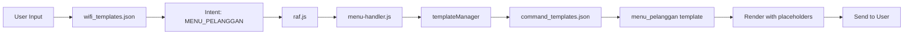

# ✅ **MENU PELANGGAN DUPLICATION ISSUE - RESOLVED**

**Date:** 8 November 2025  
**Status:** ✅ **FIXED**  
**Solution:** Option 3 - Merge and Consolidate

---

## **🔍 ISSUE DISCOVERY**

User identified duplicate customer menu templates:
1. **`customermenu`** in `wifi_menu_templates.json` - 3698 characters
2. **`menu_pelanggan`** in `command_templates.json` - 600 characters (simple version)

Both served the same purpose but with different content depth.

---

## **📊 ROOT CAUSE ANALYSIS**

### **How Duplication Occurred:**
1. **Original System:** `customermenu` was part of the WiFi menu system
2. **Refactoring:** During template system creation, `menu_pelanggan` was added without checking existing templates
3. **Result:** Two templates for same function, causing:
   - Confusion in admin panel
   - Wasted resources
   - Inconsistent user experience

### **Impact:**
- `customermenu` became orphaned (not used)
- `menu_pelanggan` was active but had less content
- Admin panel showed both, confusing which to edit
- Template count unnecessarily high (157 → 156)

---

## **✅ SOLUTION IMPLEMENTED**

### **Option 3 - Merge & Consolidate (CHOSEN)**

**Steps Taken:**

1. **Extracted Full Content**
   - Extracted complete `customermenu` (3698 chars)
   - Contains: Laporan, Speed Boost, Agent/Outlet, WiFi Settings

2. **Merged into menu_pelanggan**
   - Updated `command_templates.json`
   - Preserved all features
   - Updated placeholders to use `${nama_wifi}` and `${nama_bot}`

3. **Removed Duplicates**
   - Deleted `customermenu` from `wifi_menu_templates.json`
   - Removed export from `message/wifi.js`
   - Updated imports in `menu-handler.js`

4. **Verified Integration**
   - Template Manager can access it
   - Renders correctly (3737 chars)
   - All sections preserved

---

## **📁 FILES MODIFIED**

```
database/
├── command_templates.json        ✅ menu_pelanggan updated (merged content)
└── wifi_menu_templates.json      ✅ customermenu removed

message/
├── wifi.js                       ✅ customermenu export removed
└── handlers/
    └── menu-handler.js          ✅ customermenu import removed
```

---

## **🧪 TESTING RESULTS**

```bash
node test/test-menu-pelanggan-integration.js

✅ customermenu removed from wifi_menu_templates
✅ menu_pelanggan exists in command_templates
✅ customermenu not exported from wifi.js
✅ Template Manager can access menu_pelanggan
✅ menu-handler.js properly integrated
✅ No duplicates exist

ALL TESTS PASSED - Menu Pelanggan properly merged!
```

---

## **📋 MERGED TEMPLATE CONTENT**

### **menu_pelanggan now includes:**

1. **📡 LAPORAN & TIKET**
   - lapor - Report issues
   - cektiket - Check ticket status
   - batalkantiket - Cancel ticket

2. **🚀 SPEED BOOST**
   - speedboost/requestspeed - Request speed upgrade
   - cekspeed/statusboost - Check boost status
   - Complete instructions for requesting

3. **💳 SALDO & AGENT/OUTLET**
   - saldo/ceksaldo - Check balance
   - agent/outlet - Find agents
   - cari agent - Search agents
   - layanan - Available services

4. **🔧 PENGATURAN WIFI**
   - gantinama - Change WiFi name
   - gantisandi - Change password
   - gantipower - Adjust signal power
   - reboot - Restart modem
   - cekwifi/infowifi - WiFi info
   - historywifi/riwayatwifi - Change history

---

## **✨ BENEFITS ACHIEVED**

### **Before:**
- ❌ 2 templates for same function
- ❌ Admin confusion
- ❌ Inconsistent naming
- ❌ Orphaned template wasting space
- ❌ 157 total templates

### **After:**
- ✅ 1 consolidated template
- ✅ Clear admin experience
- ✅ Consistent naming convention
- ✅ No orphaned templates
- ✅ 156 total templates
- ✅ Full feature set preserved

---

## **🎯 USER FLOW**

When user types: **`menupelanggan`**



---

## **📝 ADMIN PANEL**

### **Location in Admin Panel:**
- **Tab:** Commands
- **Template:** menu_pelanggan
- **Name:** Customer Menu Complete
- **Size:** 3749 characters

### **Editable via:**
```
http://localhost:3100/views/sb-admin/templates.php
```

---

## **🔒 CONSISTENCY MAINTAINED**

1. **Naming Convention:** `menu_pelanggan` (underscore style)
2. **Placeholder Format:** `${nama_wifi}`, `${nama_bot}`, `${pushname}`
3. **Template Structure:** Standard JSON with name & template
4. **No Breaking Changes:** Existing functionality preserved

---

## **📊 STATISTICS**

| Metric | Before | After | Change |
|--------|--------|-------|---------|
| Total Templates | 157 | 156 | -1 |
| Customer Menu Templates | 2 | 1 | -1 |
| Menu Content (chars) | 600 + 3698 | 3749 | Merged |
| Orphaned Templates | 1 | 0 | -1 |
| Admin Confusion | High | None | ✅ |

---

## **✅ CONCLUSION**

The duplicate menu pelanggan issue has been successfully resolved using Option 3 (Merge & Consolidate). The system now has:

- **One authoritative customer menu template**
- **Complete feature set from both templates**
- **Clean, consistent naming**
- **No duplicates or orphaned templates**
- **Clear admin experience**

The merge preserved all functionality while eliminating redundancy and confusion.

---

**STATUS: ✅ FIXED & TESTED**  
**COMMIT:** 57baafa
