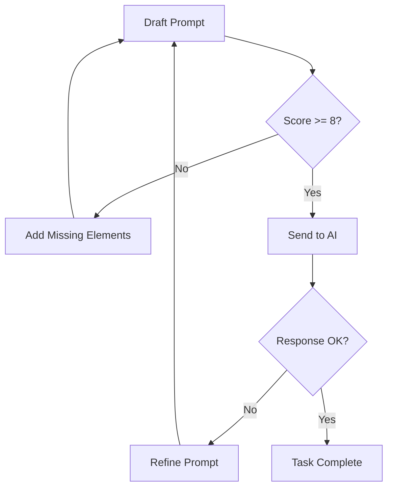

# 📚 PROMPT ENGINEERING GUIDE - RAF BOT V2

## 🎯 TUJUAN DOKUMENTASI

Panduan ini dibuat agar komunikasi antara Human dan AI menjadi:
- **Efisien** - Langsung ke tujuan tanpa iterasi berulang
- **Akurat** - AI memahami konteks dan kebutuhan dengan tepat
- **Konsisten** - Hasil yang predictable dan reliable
- **Documented** - Perubahan tercatat dengan baik

---

## 🏗️ STRUKTUR PROMPT YANG BAIK

### ANATOMI PROMPT IDEAL

```
[KONTEKS] + [TUGAS] + [INSTRUKSI] + [BATASAN] + [OUTPUT]
```

#### 1️⃣ **KONTEKS** - Berikan Background
```
"Ada bug pada fitur [nama_fitur] dimana [deskripsi_masalah]"
"Saya perlu menambahkan fitur [nama_fitur] untuk [tujuan]"
"User mengeluh bahwa [keluhan_spesifik]"
```

#### 2️⃣ **TUGAS** - Jelaskan Apa Yang Diinginkan
```
"Tolong perbaiki bug tersebut"
"Tolong tambahkan fitur ini"
"Tolong jelaskan flow dari fitur ini"
"Tolong optimasi performance"
```

#### 3️⃣ **INSTRUKSI** - Berikan Langkah Spesifik
```
"1. Baca dokumentasi [nama_file] terlebih dahulu"
"2. Identifikasi handler yang bermasalah"
"3. Perbaiki dengan mengikuti pattern yang ada"
"4. Test hasilnya"
"5. Update dokumentasi"
```

#### 4️⃣ **BATASAN** - Tetapkan Boundaries
```
"Jangan ubah business logic yang sudah ada"
"Jangan refactor ulang (sudah selesai)"
"Jangan buat handler baru jika sudah ada"
"Pertahankan backward compatibility"
```

#### 5️⃣ **OUTPUT** - Spesifikasi Hasil
```
"Berikan code fix yang siap dijalankan"
"Jelaskan perubahan yang dilakukan"
"Buat test case untuk memverifikasi"
"Update dokumentasi yang relevan"
```

---

## ✅ PRINSIP PROMPT YANG EFEKTIF

### 1. **BE SPECIFIC** - Spesifik lebih baik dari umum

❌ **BAD:**
```
"Fix the bug"
```

✅ **GOOD:**
```
"Fix bug OTP tidak muncul di notifikasi teknisi pada handler teknisi-workflow-handler.js"
```

### 2. **PROVIDE CONTEXT** - Konteks membantu pemahaman

❌ **BAD:**
```
"Tambah validasi"
```

✅ **GOOD:**
```
"Tambah validasi nomor telepon format Indonesia (08/628/+628) di balance-management-handler.js untuk fungsi transfer"
```

### 3. **REFERENCE DOCUMENTATION** - Selalu rujuk dokumentasi

❌ **BAD:**
```
"Ubah notification pattern"
```

✅ **GOOD:**
```
"Ubah notification pattern sesuai Multi-Phone Pattern di AI_MAINTENANCE_GUIDE.md bagian Post-Refactoring Key Patterns"
```

### 4. **STATE CONSTRAINTS** - Jelaskan batasan

❌ **BAD:**
```
"Optimasi photo upload"
```

✅ **GOOD:**
```
"Optimasi photo upload di teknisi-photo-handler-v3.js TANPA mengubah queue mechanism yang sudah ada, fokus pada batch processing timeout"
```

### 5. **SPECIFY OUTPUT** - Jelaskan output yang diharapkan

❌ **BAD:**
```
"Jelaskan flow lapor"
```

✅ **GOOD:**
```
"Jelaskan flow lapor gangguan dari user input sampai ticket created, include: handler involved, state transitions, dan data storage location"
```

---

## 📋 TEMPLATE PROMPT UNTUK BERBAGAI KEBUTUHAN

### 🐛 **BUG FIXING TEMPLATE**

```markdown
**BUG:** [Deskripsi bug yang spesifik]
**LOCATION:** [File/handler yang bermasalah jika diketahui]
**EXPECTED:** [Behavior yang seharusnya]
**ACTUAL:** [Behavior yang terjadi sekarang]

**INSTRUKSI:**
1. Baca AI_MAINTENANCE_GUIDE.md bagian Debugging Guide
2. Baca WORKFLOW_DOCUMENTATION.md untuk flow [nama_fitur]
3. Debug handler [nama_handler] atau identifikasi handler yang bermasalah
4. Fix bug dengan mengikuti existing patterns
5. Verifikasi multi-phone pattern jika terkait notifications
6. Test fix dengan scenario [sebutkan scenario]
7. Update dokumentasi jika ada perubahan flow

**CONSTRAINTS:**
- Jangan ubah logic yang tidak related
- Pertahankan backward compatibility
- Ikuti pattern yang sudah ada

**OUTPUT:**
- Code fix yang siap dijalankan
- Penjelasan root cause
- Test verification steps
```

### ✨ **NEW FEATURE TEMPLATE**

```markdown
**FEATURE:** [Nama fitur yang akan ditambahkan]
**PURPOSE:** [Tujuan/benefit dari fitur ini]
**USER FLOW:** [Bagaimana user akan menggunakan]

**INSTRUKSI:**
1. Baca AI_MAINTENANCE_GUIDE.md untuk struktur project
2. Baca WORKFLOW_DOCUMENTATION.md untuk existing flows
3. Tentukan kategori fitur (monitoring/wifi/payment/dll)
4. Identifikasi handler yang tepat atau buat baru jika perlu
5. Implementasi dengan pattern yang konsisten
6. Add routing case di raf.js (HANYA routing)
7. Untuk multi-step, update conversation-state-handler.js
8. Create test file test-[feature-name].js
9. Update WORKFLOW_DOCUMENTATION.md

**CONSTRAINTS:**
- Business logic HARUS di handler, BUKAN di raf.js
- Check existing handler sebelum create new
- Follow naming convention: kebab-case
- Max 1 handler per feature concern

**OUTPUT:**
- Complete implementation code
- Test file
- Documentation update
- Usage examples
```

### 🔧 **MODIFICATION TEMPLATE**

```markdown
**MODIFY:** [Apa yang akan dimodifikasi]
**FILE:** [Handler/file yang akan diubah]
**REASON:** [Kenapa perlu dimodifikasi]

**INSTRUKSI:**
1. Baca handler [nama_handler] yang akan dimodifikasi
2. Understand existing flow dan dependencies
3. Buat changes dengan minimal impact
4. Preserve existing patterns
5. Test semua affected flows
6. Update comments/documentation

**CONSTRAINTS:**
- Minimal breaking changes
- Maintain consistency
- Don't over-engineer
- Keep it simple

**OUTPUT:**
- Modified code
- List of changes made
- Impact analysis
- Test confirmation
```

### 🔍 **CODE EXPLANATION TEMPLATE**

```markdown
**EXPLAIN:** [Feature/flow yang ingin dipahami]
**DEPTH:** [High-level overview / Detailed with code]
**FOCUS:** [Specific aspect jika ada]

**INSTRUKSI:**
1. Baca WORKFLOW_DOCUMENTATION.md section [relevant_section]
2. Trace flow dari entry point ke handlers
3. Identify all handlers involved
4. Explain state management jika ada
5. Show data flow dan storage
6. Include error handling paths

**OUTPUT FORMAT:**
- Flow diagram (mermaid if possible)
- Step-by-step explanation
- Handler responsibilities
- State transitions
- Data locations
- Error scenarios
```

### ⚡ **OPTIMIZATION TEMPLATE**

```markdown
**OPTIMIZE:** [Component yang akan dioptimasi]
**CURRENT ISSUE:** [Performance problem saat ini]
**TARGET:** [Goal optimization]

**INSTRUKSI:**
1. Analyze current implementation di [handler_name]
2. Identify bottlenecks
3. Propose optimization WITHOUT breaking changes
4. Maintain existing patterns
5. Add performance logging
6. Create benchmark test

**CONSTRAINTS:**
- No breaking changes
- Keep existing patterns
- Don't sacrifice readability
- Maintain error handling

**OUTPUT:**
- Optimized code
- Performance comparison
- Risk assessment
- Rollback plan
```

---

## 🚫 ANTI-PATTERNS - JANGAN LAKUKAN INI

### ❌ **VAGUE REQUESTS**
```
"Fix semua bug"
"Buat lebih baik"
"Perbaiki performance"
```

### ❌ **NO CONTEXT**
```
"Tambah fitur X" (tanpa menjelaskan X itu apa)
"Error di line 123" (tanpa mention file)
```

### ❌ **ASSUMING AI KNOWS EVERYTHING**
```
"Kamu tahu kan masalahnya" 
"Seperti yang kemarin"
"Lanjutkan yang tadi"
```

### ❌ **TOO MANY TASKS IN ONE PROMPT**
```
"Fix bug A, tambah fitur B, optimize C, explain D, dan test semuanya"
```

### ❌ **IGNORING DOCUMENTATION**
```
"Langsung aja fix, gak usah baca docs"
"Skip dokumentasi, cepat selesaikan"
```

---

## 🎯 QUICK REFERENCE - PROMPT STARTERS

### Untuk Debugging:
```
"Ada bug [description]. Tolong baca AI_MAINTENANCE_GUIDE.md dulu, lalu..."
```

### Untuk Feature Baru:
```
"Saya perlu fitur [name] untuk [purpose]. Baca dokumentasi struktur dulu, lalu..."
```

### Untuk Modifikasi:
```
"Ubah [what] di [where] karena [why]. Pertahankan pattern existing..."
```

### Untuk Pemahaman:
```
"Jelaskan flow [feature] dari WORKFLOW_DOCUMENTATION.md dengan detail..."
```

### Untuk Optimasi:
```
"[Component] lambat karena [issue]. Optimasi tanpa breaking changes..."
```

---

## 📊 PROMPT SCORING RUBRIC

Rate your prompt sebelum send:

| Kriteria | Score | Check |
|----------|-------|-------|
| Specificity | 0-2 | Apakah spesifik? |
| Context | 0-2 | Ada background? |
| Instructions | 0-2 | Langkah jelas? |
| Constraints | 0-2 | Batasan clear? |
| Output Spec | 0-2 | Output defined? |

**Score Interpretation:**
- 8-10: Excellent prompt ✅
- 6-7: Good, bisa lebih baik
- 4-5: Perlu improvement
- <4: Terlalu vague ❌

---

## 💡 PRO TIPS

### 1. **Start Small**
Lebih baik beberapa prompt focused daripada satu prompt giant

### 2. **Iterative Refinement**
Tidak masalah memperbaiki prompt based on response

### 3. **Save Good Prompts**
Simpan prompt yang berhasil untuk reuse

### 4. **Learn from AI Response**
Jika AI minta klarifikasi, improve prompt next time

### 5. **Use Examples**
Berikan contoh input/output jika complex

### 6. **Reference Line Numbers**
Jika tahu, mention specific line numbers

### 7. **Test Instructions**
Selalu include test/verification steps

---

## 📝 CONTOH PROMPT REAL-WORLD

### EXCELLENT PROMPT ✅
```
Ada bug OTP tidak muncul saat teknisi sampai lokasi. 

Tolong:
1. Baca AI_MAINTENANCE_GUIDE.md section Debugging Guide
2. Check teknisi-workflow-handler.js function handleSampaiLokasi()
3. Verify ticket.otp exists dan properly displayed
4. Check multi-phone notification pattern implementation
5. Add recovery mechanism jika OTP missing (generate new)
6. Test dengan scenario: teknisi sampai tanpa OTP existing

Constraints:
- Maintain box format display untuk OTP
- Semua nomor pelanggan harus terima notification
- Backward compatible dengan ticket lama

Expected output:
- Fixed code dengan recovery mechanism
- Test verification steps
- Log statements untuk debugging
```

### POOR PROMPT ❌
```
otp gak muncul, fix
```

---

## 🔄 PROMPT ITERATION WORKFLOW



---

## 📚 RELATED DOCUMENTATION

- **AI_MAINTENANCE_GUIDE.md** - Technical maintenance guide
- **AI_PROMPT_GUIDE.md** - Quick prompt templates  
- **WORKFLOW_DOCUMENTATION.md** - Complete flow mapping
- **REFACTORING_SUMMARY.md** - Current architecture state

---

## ✨ KESIMPULAN

Prompt yang baik adalah:
1. **SPECIFIC** - Jelas apa yang diminta
2. **CONTEXTUAL** - Ada background info
3. **INSTRUCTIVE** - Ada steps to follow
4. **BOUNDED** - Ada constraints/limits
5. **MEASURABLE** - Output bisa diverifikasi

Dengan prompt yang baik, AI bisa memberikan solusi yang tepat pada percobaan pertama!

---

*Last Updated: November 3, 2025*
*Version: 1.0*
*Purpose: Comprehensive guide for effective AI prompting*
