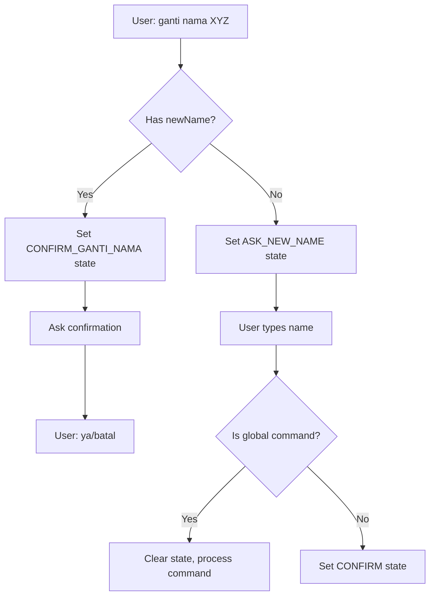
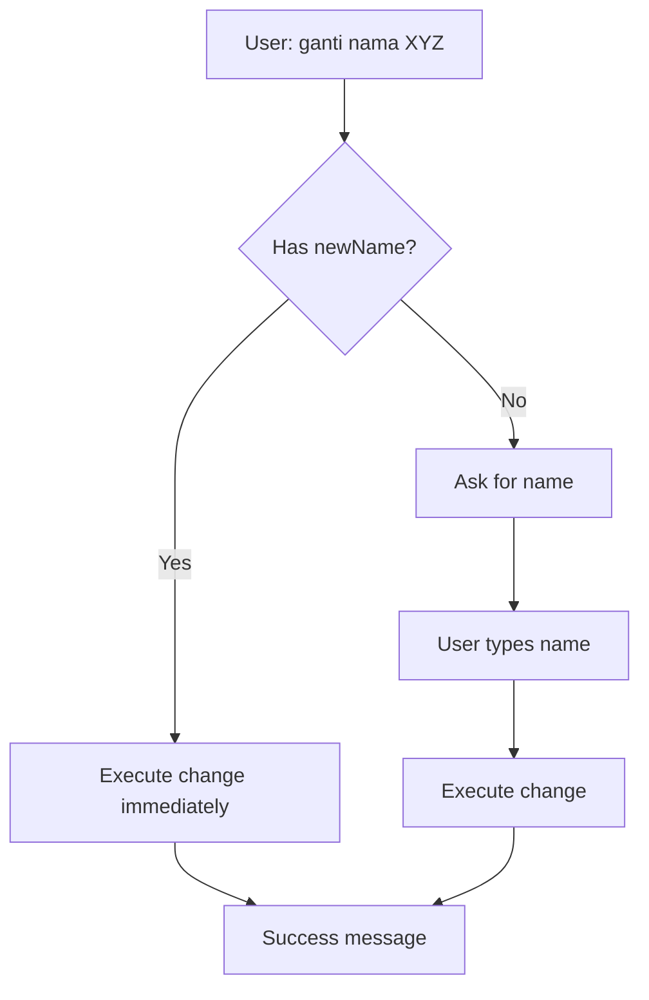

# 📋 COMPREHENSIVE WIFI FEATURES ANALYSIS & IMPROVEMENT PROMPT

## 📊 CURRENT STATE ANALYSIS

### 🔴 CRITICAL ISSUES IDENTIFIED

#### 1. **EXCESSIVE CONFIRMATION STEPS**
**Problem**: Unnecessary confirmation dialogs for simple operations
- **Ganti Nama WiFi**: When user types `ganti nama HAI`, system asks for confirmation "ya" or "batal"
- **Ganti Password WiFi**: Similar confirmation required
- **Reboot Modem**: Also requires confirmation

**Impact**: Poor UX, makes simple tasks tedious

**Current Flow (WRONG):**
```
User: ganti nama RAFNet
Bot: Baik, nama WiFi akan diubah menjadi "RAFNet". Sudah benar?
     Balas 'ya' untuk melanjutkan.
User: ya
Bot: [Executes change]
```

**Expected Flow (CORRECT):**
```
User: ganti nama RAFNet
Bot: ✅ Nama WiFi berhasil diubah menjadi "RAFNet"
     Perubahan akan aktif dalam 1-2 menit.
```

#### 2. **STATE INTERCEPTION BY GLOBAL COMMANDS**
**Problem**: User inputs during state handling get hijacked by global commands
- When in `ASK_NEW_NAME` state, user types "HAI" → triggers `SAPAAN_UMUM` instead
- Common words like "hai", "p", "min", "kak", "mas" are all global commands
- State gets cleared, user loses progress

**Example Scenario:**
```
User: ganti nama wifi
Bot: Silakan ketik nama WiFi baru
User: HAI
Bot: Halo! Ada yang bisa saya bantu? [WRONG - should use "HAI" as WiFi name]
```

#### 3. **OVERLY COMPLEX STATE MACHINE**
**Current States for Name Change:**
- `SELECT_CHANGE_MODE`
- `SELECT_CHANGE_MODE_FIRST`
- `SELECT_SSID_TO_CHANGE`
- `ASK_NEW_NAME_FOR_SINGLE`
- `ASK_NEW_NAME_FOR_SINGLE_BULK`
- `ASK_NEW_NAME_FOR_BULK`
- `ASK_NEW_NAME_FOR_BULK_AUTO`
- `CONFIRM_GANTI_NAMA`
- `CONFIRM_GANTI_NAMA_BULK`

**Problem**: Too many states for what should be simple operations

#### 4. **INCONSISTENT BEHAVIOR ACROSS FEATURES**
- **Ganti Power**: Direct change, no confirmation ✅
- **Ganti Nama**: Multiple confirmations ❌
- **Ganti Password**: Multiple confirmations ❌
- **Reboot**: Confirmation required ❌
- **Cek WiFi**: Direct execution ✅

### 📁 FILE STRUCTURE & RESPONSIBILITIES

```
message/handlers/
├── wifi-management-handler.js     # Name & password changes (problematic)
├── wifi-check-handler.js         # Status checking (good)
├── wifi-power-handler.js         # Power adjustment (good)
├── reboot-modem-handler.js       # Reboot functionality (confirmation issue)
└── states/
    ├── wifi-name-state-handler.js     # Name change states (overly complex)
    └── wifi-password-state-handler.js # Password change states (overly complex)
```

### 📊 DETAILED FLOW ANALYSIS

#### **CURRENT: Ganti Nama WiFi Flow**


#### **DESIRED: Ganti Nama WiFi Flow**


## 🎯 IMPROVEMENT REQUIREMENTS

### 1. **REMOVE UNNECESSARY CONFIRMATIONS**
- Direct execution for: `ganti nama`, `ganti password`
- Keep confirmation ONLY for destructive actions (reboot)
- Add undo/rollback info instead of pre-confirmations

### 2. **FIX STATE INTERCEPTION**
- When in WiFi-related states, prioritize user input as data, not commands
- Implement state-specific input handling
- Whitelist certain words from being global commands when in states

### 3. **SIMPLIFY STATE MACHINE**
**New States (Maximum 2 per operation):**
- `WIFI_NAME_INPUT` - Only if name not provided
- `WIFI_PASSWORD_INPUT` - Only if password not provided
- Remove all confirmation states

### 4. **STANDARDIZE BEHAVIOR**
All WiFi operations should follow same pattern:
- If parameter provided → Execute immediately
- If parameter missing → Ask once, then execute
- No confirmations except for destructive operations

## 📝 IMPLEMENTATION CHECKLIST

### Phase 1: Fix State Interception
- [ ] Modify conversation-state-handler to check state context
- [ ] When in WiFi input states, treat text as input, not commands
- [ ] Exception: "batal" should always work to cancel

### Phase 2: Remove Confirmations
- [ ] Update wifi-management-handler handleGantiNamaWifi
- [ ] Update wifi-management-handler handleGantiSandiWifi
- [ ] Simplify wifi-name-state-handler
- [ ] Simplify wifi-password-state-handler

### Phase 3: Simplify States
- [ ] Reduce states to maximum 2 per operation
- [ ] Remove all CONFIRM_* states
- [ ] Update state transitions

### Phase 4: Testing & Validation
- [ ] Test "ganti nama HAI" → Should change to "HAI"
- [ ] Test "ganti nama" then "HAI" → Should change to "HAI"
- [ ] Test all edge cases with common words
- [ ] Verify rollback/undo messaging

## 🔧 TECHNICAL SPECIFICATIONS

### **New handleGantiNamaWifi Logic:**
```javascript
async function handleGantiNamaWifi({ sender, args, matchedKeywordLength, ...params }) {
    // 1. Parse input
    const newName = extractNewName(args, matchedKeywordLength);
    
    // 2. Validate user
    const user = findUser(sender, isOwner, isTeknisi);
    if (!user) return handleUserNotFound();
    
    // 3. Check if name provided
    if (newName) {
        // Direct execution
        return executeNameChange(user, newName);
    } else {
        // Ask for input ONCE
        setSimpleState(sender, 'WIFI_NAME_INPUT', { user });
        return reply("Silakan ketik nama WiFi baru (max 32 karakter):");
    }
}
```

### **New State Handler Logic:**
```javascript
if (state === 'WIFI_NAME_INPUT') {
    // IMPORTANT: Don't check for global commands here
    const newName = message.trim();
    
    // Only check for cancel
    if (newName.toLowerCase() === 'batal') {
        clearState(sender);
        return reply("✅ Proses dibatalkan");
    }
    
    // Validate and execute
    if (validateWifiName(newName)) {
        clearState(sender);
        return executeNameChange(state.user, newName);
    }
}
```

### **Success Response Pattern:**
```javascript
// Immediate success with rollback info
reply(`✅ *Berhasil!*

Nama WiFi telah diubah menjadi: *"${newName}"*

📝 *Info Penting:*
• Perubahan aktif dalam 1-2 menit
• Modem akan restart otomatis
• Nama lama: "${oldName}"

⚠️ Jika ada masalah, hubungi admin untuk rollback.`);
```

## 🚫 DO NOT

1. **DO NOT** add confirmations for non-destructive operations
2. **DO NOT** let global commands interrupt input states
3. **DO NOT** create more than 2 states per operation
4. **DO NOT** use complex state machines for simple tasks
5. **DO NOT** treat user data input as commands

## ✅ ALWAYS

1. **ALWAYS** execute immediately when parameters are complete
2. **ALWAYS** provide rollback/undo information
3. **ALWAYS** validate input before execution
4. **ALWAYS** handle "batal" command in states
5. **ALWAYS** maintain consistency across all WiFi features

## 📊 SUCCESS METRICS

After implementation, these should work:
```
✅ User: ganti nama HAI
   Bot: Nama WiFi berhasil diubah menjadi "HAI"

✅ User: ganti password 12345678
   Bot: Password WiFi berhasil diubah

✅ User: ganti nama
   Bot: Silakan ketik nama baru
   User: HAI
   Bot: Nama WiFi berhasil diubah menjadi "HAI"

✅ User: reboot modem
   Bot: Yakin ingin reboot? (ya/batal)
   User: ya
   Bot: Modem sedang direboot
```

## 🔍 TESTING SCENARIOS

### Test Case 1: Direct Execution
```
Input: ganti nama RAFNet2024
Expected: Immediate change, no confirmation
```

### Test Case 2: Two-Step with Common Word
```
Input: ganti nama
Bot: Silakan ketik nama baru
Input: hai
Expected: Changes to "hai", NOT trigger greeting
```

### Test Case 3: Cancel Operation
```
Input: ganti nama
Bot: Silakan ketik nama baru
Input: batal
Expected: Cancel operation cleanly
```

### Test Case 4: Edge Cases
```
Inputs to test as WiFi names:
- "p" (currently SAPAAN_UMUM)
- "hai" (currently SAPAAN_UMUM)
- "menu" (currently MENU_UTAMA)
- "123456"
- "WiFi-Home_2024.net"
```

## 📝 IMPLEMENTATION NOTES

### Priority Order:
1. **HIGH**: Fix state interception (users can't even set WiFi name to "HAI")
2. **HIGH**: Remove unnecessary confirmations
3. **MEDIUM**: Simplify state machine
4. **LOW**: Add better error messages and rollback info

### Affected Files:
- `message/raf.js` - Global command detection logic
- `message/handlers/wifi-management-handler.js` - Main WiFi operations
- `message/handlers/conversation-state-handler.js` - State routing
- `message/handlers/states/wifi-name-state-handler.js` - Name states
- `message/handlers/states/wifi-password-state-handler.js` - Password states
- `message/handlers/reboot-modem-handler.js` - Reboot logic

### Backward Compatibility:
- Ensure existing commands still work
- Maintain support for admin/teknisi ID-based operations
- Keep bulk SSID functionality for users with multiple SSIDs

---

**⚠️ CRITICAL**: This analysis reveals fundamental UX issues that make the bot frustrating to use. The excessive confirmations and state interception bugs significantly degrade user experience. These should be fixed with high priority.
