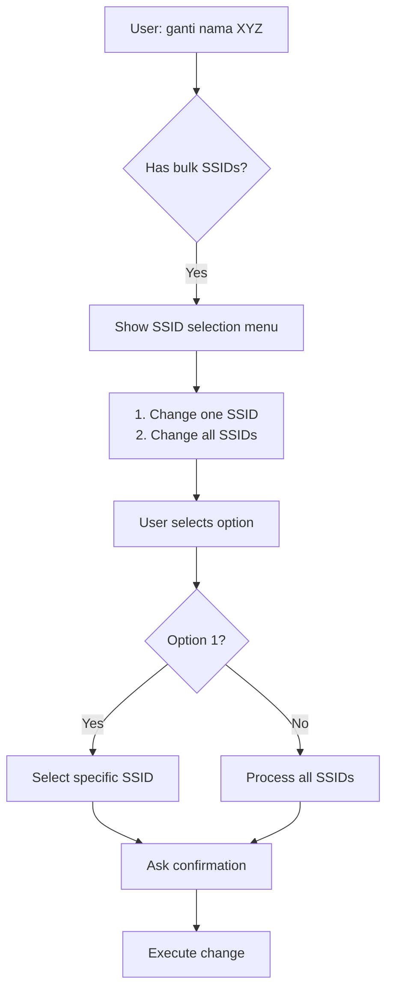
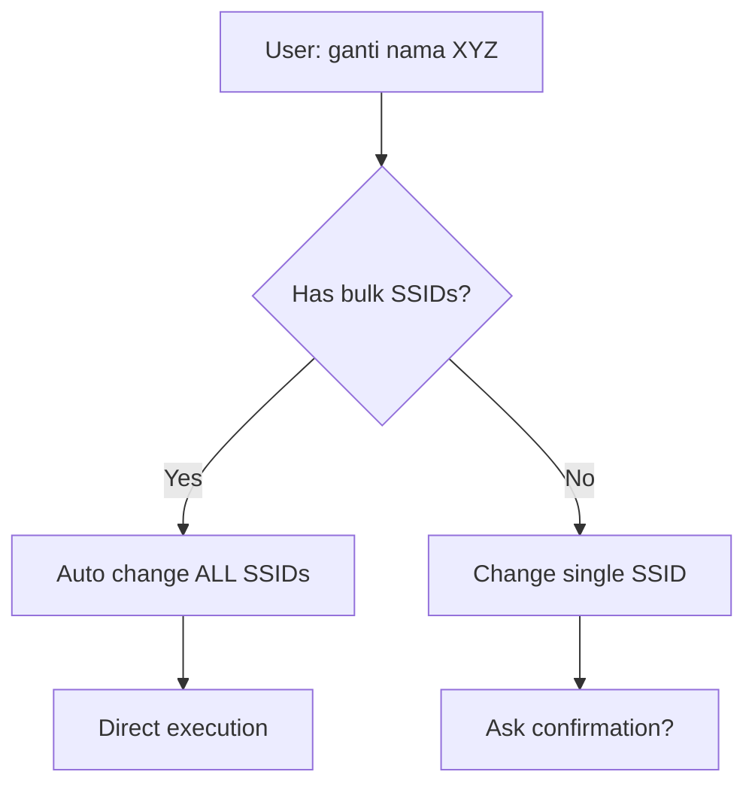
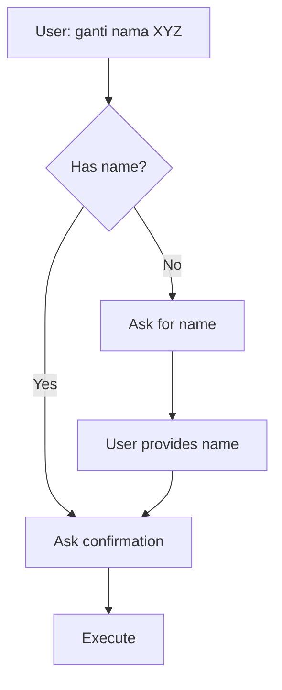

# 📋 COMPREHENSIVE WIFI FEATURES ANALYSIS V2 - WITH CONFIG AWARENESS

## ⚠️ CRITICAL DISCOVERY: CONFIG-DRIVEN BEHAVIOR

### **Configuration Parameter: `custom_wifi_modification`**
Located in: `config.json` line 140
```json
"custom_wifi_modification": false  // Default value
```

This single config controls the entire WiFi modification flow!

## 🔄 FLOW VARIATIONS BASED ON CONFIG

### **When `custom_wifi_modification = TRUE` + User has Bulk SSIDs:**


### **When `custom_wifi_modification = FALSE` + User has Bulk SSIDs:**


### **When User has Single SSID (regardless of config):**


## 📊 DETAILED BEHAVIORAL MATRIX

| Scenario | Config Mode | User Type | Has Bulk | Current Behavior | Issues |
|----------|------------|-----------|----------|------------------|--------|
| 1 | TRUE | Customer | Yes | Shows menu, asks confirmation | Too many steps |
| 2 | TRUE | Customer | No | Asks confirmation | Unnecessary confirmation |
| 3 | FALSE | Customer | Yes | Auto-changes all SSIDs | Good if intended |
| 4 | FALSE | Customer | No | Asks confirmation | Unnecessary confirmation |
| 5 | TRUE | Admin/Teknisi | Yes | Shows menu, asks confirmation | OK for admin |
| 6 | TRUE | Admin/Teknisi | No | Asks confirmation | Maybe OK |
| 7 | FALSE | Admin/Teknisi | Yes | Auto-changes all | Dangerous for admin? |
| 8 | FALSE | Admin/Teknisi | No | Asks confirmation | Maybe OK |

## 🔴 CORE ISSUES REMAIN

### 1. **State Interception Problem (STILL EXISTS)**
```javascript
// Current Issue in raf.js
const staticIntents = {
    'hai': 'SAPAAN_UMUM',  // Problem!
    'menu': 'MENU_UTAMA',   // Problem!
    'p': 'SAPAAN_UMUM'      // Problem!
}
```

**Impact**: Users CANNOT use common words as WiFi names regardless of config!

### 2. **Inconsistent Confirmation Logic**
- Single SSID ALWAYS asks confirmation (even when config=false)
- Bulk SSIDs respect config for auto-execution
- This creates inconsistent UX

### 3. **Complex State Machine (PARTIALLY JUSTIFIED)**
States are needed for:
- SSID selection (when custom_wifi_modification=true)
- Mode selection (bulk vs single)
- Name/password input (when not provided)

But NOT needed for:
- Simple confirmations on non-destructive operations
- Single SSID confirmations when config=false

## 🎯 SMART IMPROVEMENT STRATEGY

### **Option 1: FULL FLEXIBILITY (Current Implementation)**
Keep all states and confirmations, controlled by config.

**Pros:**
- Maximum flexibility for providers
- Can enable/disable features via config

**Cons:**
- Complex code
- State interception bugs
- Poor default UX

### **Option 2: SMART DEFAULTS**
Improve defaults while keeping config option.

**When `custom_wifi_modification = TRUE`:**
- Keep current behavior (menus, selections, confirmations)

**When `custom_wifi_modification = FALSE`:**
- NO confirmations for any WiFi changes
- Direct execution always
- Still ask for input if not provided

**Always (regardless of config):**
- Fix state interception for WiFi input states
- Allow "batal" to cancel
- Protect user inputs from global commands

### **Option 3: CONTEXT-AWARE CONFIRMATIONS**
Confirmations based on operation risk, not config.

**Never confirm:**
- Name changes (reversible)
- Power changes (reversible)

**Always confirm:**
- Password changes (users might forget)
- Reboot (disruptive)
- Bulk operations affecting multiple SSIDs

**Config controls:**
- Whether to show SSID selection menu
- Whether to auto-apply to all SSIDs

## 📝 IMPLEMENTATION RECOMMENDATIONS

### **Phase 1: Fix Critical Bugs (MUST DO)**
```javascript
// Fix state interception in raf.js
const wifiInputStates = [
    'ASK_NEW_NAME_FOR_SINGLE',
    'ASK_NEW_NAME_FOR_BULK',
    'ASK_NEW_PASSWORD',
    // ... etc
];

// Don't check global commands when in WiFi input states
if (isInWifiInputState) {
    // Only check for 'batal'
    if (message.toLowerCase() === 'batal') {
        clearState();
        return;
    }
    // Otherwise treat as input data
    processWifiInput(message);
}
```

### **Phase 2: Implement Config-Aware Logic**
```javascript
function shouldAskConfirmation(operation, config) {
    // Destructive operations always ask
    if (operation === 'password' || operation === 'reboot') {
        return true;
    }
    
    // Name/power changes depend on config
    if (config.custom_wifi_modification) {
        return true; // Provider wants confirmations
    }
    
    return false; // Direct execution
}
```

### **Phase 3: Simplify States Conditionally**
```javascript
function handleWifiNameChange(user, newName, config) {
    if (!newName) {
        setState('ASK_NAME');
        return askForName();
    }
    
    if (shouldAskConfirmation('name', config)) {
        setState('CONFIRM_NAME');
        return askConfirmation(newName);
    }
    
    // Direct execution
    return executeName

Change(newName);
}
```

## 🚫 ROLLBACK NEEDED

The changes made in the previous fix need to be rolled back because:
1. Removed confirmation states that are still needed when `custom_wifi_modification = true`
2. Direct execution was forced even when config expects confirmations
3. Didn't consider the provider's need for flexibility

## ✅ CORRECT APPROACH

### **1. Keep All States**
```javascript
// These states MUST remain for flexibility
CONFIRM_GANTI_NAMA
CONFIRM_GANTI_NAMA_BULK  
CONFIRM_GANTI_SANDI
CONFIRM_GANTI_SANDI_BULK
SELECT_CHANGE_MODE
SELECT_SSID_TO_CHANGE
```

### **2. Make Behavior Config-Driven**
```javascript
// Check config before asking confirmation
if (global.config.custom_wifi_modification) {
    // Show menus and confirmations
    setState('CONFIRM_GANTI_NAMA');
} else {
    // Direct execution
    executeNameChange();
}
```

### **3. Fix State Interception (CRITICAL)**
```javascript
// Protected input states - regardless of config
const protectedInputStates = [
    'ASK_NEW_NAME_*',
    'ASK_NEW_PASSWORD_*'
];

// Don't let global commands interrupt these states
if (isProtectedState && message !== 'batal') {
    // Treat as input, not command
}
```

## 📊 TESTING MATRIX

| Test Case | Config | Input | Expected Result |
|-----------|--------|-------|-----------------|
| Name with "hai" | TRUE | ganti nama → hai | Asks confirmation, uses "hai" as name |
| Name with "hai" | FALSE | ganti nama → hai | Direct execution with "hai" |
| Direct name | TRUE | ganti nama WiFiKu | Asks confirmation |
| Direct name | FALSE | ganti nama WiFiKu | Direct execution |
| Bulk SSIDs | TRUE | ganti nama | Shows SSID menu |
| Bulk SSIDs | FALSE | ganti nama | Changes all SSIDs |
| Cancel | Any | ganti nama → batal | Cancels operation |

## 🔧 TECHNICAL DEBT TO ADDRESS

### **1. Inconsistent Handler Patterns**
- `wifi-management-handler.js` - Complex branching
- `wifi-power-handler.js` - Simple direct execution
- `reboot-modem-handler.js` - Always confirms

### **2. State Management Complexity**
- States in `temp[sender]`
- States in `smartReportState`
- States in conversation handlers
- No central state machine

### **3. Config Validation**
- No validation that config values are boolean
- No defaults if config missing
- No documentation of config effects

## 📝 DOCUMENTATION NEEDED

### **For Providers (Admin Dashboard):**
```
## Mode Kustom Ganti WiFi

When ENABLED:
- Users see SSID selection menu
- All changes require confirmation
- Step-by-step guidance

When DISABLED:
- Direct execution of commands
- Auto-applies to all SSIDs
- Faster but less control
```

### **For Developers:**
```javascript
/**
 * Config: custom_wifi_modification
 * 
 * TRUE: 
 *   - Shows SSID selection menus
 *   - Requires confirmations
 *   - Multi-step process
 * 
 * FALSE:
 *   - Direct execution
 *   - Auto-applies to all SSIDs
 *   - Minimal steps
 * 
 * NOTE: State interception fix applies regardless
 */
```

## 🎯 FINAL RECOMMENDATIONS

### **MUST FIX (Critical):**
1. State interception bug - users can't use common words
2. Config-aware confirmation logic
3. Consistent behavior across features

### **SHOULD FIX (Important):**
1. Simplify states when config=false
2. Better error messages
3. Clear documentation

### **NICE TO HAVE:**
1. Undo/rollback feature
2. Preview changes before execution
3. Batch operations UI

## 📊 IMPLEMENTATION PRIORITY

### **Priority 1: Fix State Interception**
**Why**: Critical bug affecting all users
**How**: Protect WiFi input states from global commands
**Impact**: High - enables using any word as WiFi name

### **Priority 2: Implement Config Logic**
**Why**: Respect provider's configuration choice
**How**: Check config before confirmations
**Impact**: Medium - improves UX based on provider preference

### **Priority 3: Document Behavior**
**Why**: Confusion about how config works
**How**: Add clear documentation and comments
**Impact**: Medium - helps future maintenance

### **Priority 4: Optimize States**
**Why**: Too complex for simple operations
**How**: Conditionally skip states based on config
**Impact**: Low - code quality improvement

---

## ⚠️ IMPORTANT NOTES

1. **DO NOT remove confirmation states** - they're needed when config=true
2. **DO NOT force direct execution** - respect the config setting
3. **DO fix state interception** - critical bug regardless of config
4. **DO add config checks** - before asking confirmations
5. **DO document the behavior** - it's complex and needs explanation

## 🔄 ROLLBACK INSTRUCTIONS

The previous changes need to be reverted:
1. Restore CONFIRM_GANTI_NAMA states
2. Restore CONFIRM_GANTI_SANDI states  
3. Add config checks before direct execution
4. Keep state interception fixes

---

**This analysis considers the full picture including the configuration-driven behavior that allows providers to customize the user experience.**
