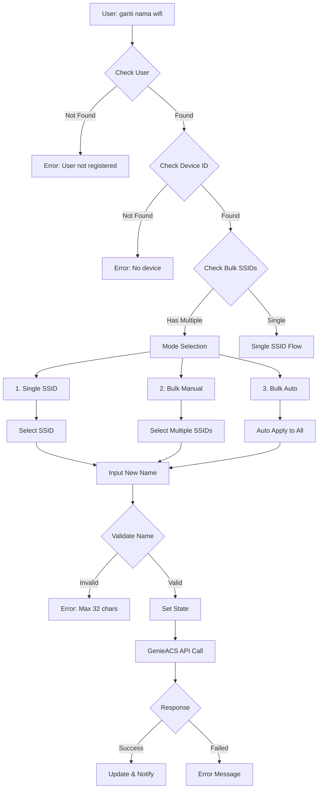
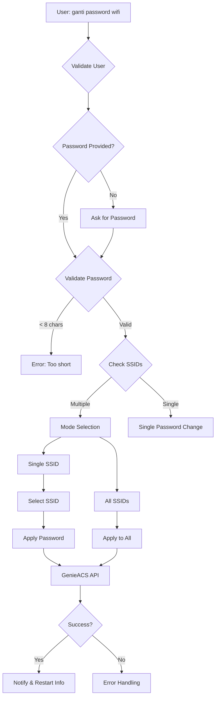

# 🔍 ANALISIS LENGKAP SISTEM WIFI MANAGEMENT RAF BOT V2

## 📋 EXECUTIVE SUMMARY

Sistem WiFi Management RAF Bot V2 adalah sistem terintegrasi untuk mengelola perangkat WiFi pelanggan melalui WhatsApp Bot dengan backend GenieACS untuk device management.

---

## 🏗️ ARSITEKTUR SISTEM

```
┌─────────────────┐     ┌──────────────┐     ┌─────────────┐
│   WhatsApp      │────▶│   RAF Bot    │────▶│  GenieACS   │
│   User Input    │     │   (Node.js)  │     │   Server    │
└─────────────────┘     └──────────────┘     └─────────────┘
                              │                      │
                              ▼                      ▼
                        ┌──────────┐          ┌──────────┐
                        │  SQLite  │          │  Modem   │
                        │ Database │          │ Customer │
                        └──────────┘          └──────────┘
```

---

## 📂 STRUKTUR FILE WIFI MANAGEMENT

```
message/
├── raf.js                                   # Router utama (1,866 lines)
│   ├── Case: GANTI_NAMA_WIFI (line 1416)
│   ├── Case: GANTI_SANDI_WIFI (line 1434) 
│   ├── Case: GANTI_POWER_WIFI (line 1452)
│   ├── Case: REBOOT_MODEM (line 1468)
│   └── Case: CEK_WIFI (line 1484)
│
└── handlers/
    ├── wifi-management-handler.js          # Ganti nama & password (437 lines)
    │   ├── handleGantiNamaWifi()
    │   └── handleGantiSandiWifi()
    │
    ├── wifi-check-handler.js               # Cek status WiFi (144 lines)
    │   └── handleCekWifi()
    │
    ├── wifi-power-handler.js               # Adjust power (69 lines)
    │   └── handleGantiPowerWifi()
    │
    ├── reboot-modem-handler.js             # Reboot modem
    │   └── handleRebootModem()
    │
    └── states/
        ├── wifi-name-state-handler.js      # State ganti nama (244 lines)
        │   ├── handleSelectChangeMode()
        │   ├── handleSelectSsidToChange()
        │   ├── handleAskNewName()
        │   └── handleConfirmGantiNamaBulk()
        │
        ├── wifi-password-state-handler.js  # State ganti password (365 lines)
        │   ├── handleSelectPasswordMode()
        │   ├── handleAskNewPassword()
        │   └── handleConfirmGantiSandiBulk()
        │
        └── steps/
            ├── wifi-steps.js                # Legacy steps
            └── wifi-steps-bulk.js           # Bulk operations (712 lines)

lib/
├── wifi.js                                  # WiFi utility functions
│   ├── getSSIDInfo()
│   ├── setSSIDName()
│   └── setPassword()
│
└── database.js                              # Database operations
    └── User data loading
```

---

## 🔄 FITUR 1: GANTI NAMA WIFI

### **A. ENTRY POINTS & TRIGGERS**

```javascript
// Keywords yang memicu fitur:
'ganti nama wifi', 'ubah nama wifi', 'change wifi name', 
'rename wifi', 'gantinama', 'changenama'

// Case di raf.js:
case 'GANTI_NAMA_WIFI': {  // Line 1416
    const { handleGantiNamaWifi } = require('./handlers/wifi-management-handler');
    await handleGantiNamaWifi({...params});
}
```

### **B. FLOW DIAGRAM GANTI NAMA WIFI**



### **C. MODE OPERATIONS**

#### **1. SINGLE MODE**
```javascript
// State flow:
IDLE → SELECT_MODE → SELECT_SSID → ASK_NEW_NAME → CONFIRM → EXECUTE

// Data struktur:
temp[sender] = {
    step: 'ASK_NEW_NAME_FOR_SINGLE',
    targetUser: user,
    ssid_id: '1',
    nama_wifi_baru: 'WiFiBaruKu'
}

// GenieACS Parameter:
InternetGatewayDevice.LANDevice.1.WLANConfiguration.1.SSID
```

#### **2. BULK MANUAL MODE**
```javascript
// User bisa pilih SSID mana saja
temp[sender] = {
    step: 'SELECT_SSID_TO_CHANGE',
    targetUser: user,
    bulk_ssids: ['1', '2', '3'],
    selected_ssid_indices: [0, 2]  // Pilih SSID 1 dan 3
}
```

#### **3. BULK AUTO MODE**
```javascript
// Apply ke semua SSID otomatis
const parameterValues = user.bulk.map(ssidId => {
    return [`InternetGatewayDevice.LANDevice.1.WLANConfiguration.${ssidId}.SSID`, 
            newName, "xsd:string"];
});
```

### **D. VALIDATION RULES**

| Rule | Value | Error Message |
|------|-------|---------------|
| Max Length | 32 chars | "Nama WiFi terlalu panjang" |
| Min Length | 1 char | "Nama tidak boleh kosong" |
| Allowed Chars | Alphanumeric, space, dash, dot | - |
| Duplicate Check | No | - |

---

## 🔐 FITUR 2: GANTI PASSWORD WIFI

### **A. FLOW DIAGRAM**



### **B. PASSWORD VALIDATION**

```javascript
// Rules:
if (newPassword.length < 8) {
    return reply("⚠️ Kata sandi terlalu pendek, minimal 8 karakter");
}

// GenieACS Parameter:
`InternetGatewayDevice.LANDevice.1.WLANConfiguration.${ssidId}.PreSharedKey.1.PreSharedKey`
```

### **C. SECURITY CONSIDERATIONS**

1. **Password tidak di-log plain text**
2. **Masking di reply** - Password ditampilkan dengan format tertentu
3. **Restart warning** - User diberitahu modem akan restart
4. **Multi-device notification** - Semua device akan disconnect

---

## 📡 FITUR 3: CEK STATUS WIFI

### **A. DATA COLLECTION FLOW**

```javascript
// Step 1: Refresh device data
await refreshDevice(deviceId, "InternetGatewayDevice.LANDevice.1");
await refreshDevice(deviceId, "VirtualParameters");

// Step 2: Wait for update (10 seconds)
await sleep(10000);

// Step 3: Get SSID info
const { uptime, ssid } = await getSSIDInfo(user.device_id);

// Step 4: Filter SSIDs based on user config
if (user.bulk && user.bulk.length > 0) {
    filteredSsids = ssid.filter(s => bulkSsidIds.includes(String(s.id)));
} else {
    filteredSsids = ssid.filter(s => String(s.id) === "1");
}
```

### **B. INFORMATION DISPLAYED**

```
📡 STATUS MODEM ANDA
⏱️ Uptime: 2 days 14:23:45

📶 SSID: "WiFiRumah" (SSID ID: 1)
   ⚡ Transmit Power: 80%
   Devices Connected (3):
    1. iPhone-Budi (IP: 192.168.1.101) Signal: -45 dBm
    2. Laptop-Ani (IP: 192.168.1.102) Signal: -52 dBm
    3. SmartTV (IP: 192.168.1.103) Signal: -68 dBm
```

### **C. ERROR SCENARIOS**

| Error | Cause | User Message |
|-------|-------|--------------|
| Device Offline | Modem mati/tidak terjangkau | "Modem sedang offline" |
| 404 Not Found | Device ID invalid | "Device tidak ditemukan di sistem" |
| Timeout | GenieACS tidak respond | "Timeout, coba lagi nanti" |
| No SSID | SSID info kosong | "Informasi SSID tidak tersedia" |

---

## ⚡ FITUR 4: ADJUST WIFI POWER

### **A. POWER LEVELS**

```javascript
// Available power levels (dalam persen):
const validPowers = ['100', '80', '60', '40', '20'];

// GenieACS Parameter:
"InternetGatewayDevice.LANDevice.1.WLANConfiguration.1.TransmitPower"
```

### **B. COMMAND FORMAT**

```
User: "gantipower 80"
Bot: "Power WiFi berhasil dirubah ke 80%"

// Validation:
if (!['100', '80', '60', '40', '20'].includes(q)) {
    throw "Power hanya bisa 100, 80, 60, 40, 20";
}
```

### **C. USE CASES**

| Power | Coverage | Use Case |
|-------|----------|----------|
| 100% | Maximum | Rumah besar, multi-lantai |
| 80% | Large | Rumah standard |
| 60% | Medium | Apartemen/rumah kecil |
| 40% | Small | Studio/kamar |
| 20% | Minimum | Testing/hemat daya |

---

## 🔄 FITUR 5: REBOOT MODEM

### **A. CONFIRMATION FLOW**

```javascript
// State flow:
temp[sender] = {
    step: 'CONFIRM_REBOOT',
    targetUser: user
}

// Confirmation message:
"Anda yakin ingin reboot modem? Koneksi akan terputus 2-3 menit"
```

### **B. REBOOT PROCESS**

```javascript
// GenieACS reboot command:
{
    name: 'reboot'
}

// Expected behavior:
1. Send reboot command
2. Modem restart (2-3 menit)
3. Auto reconnect
4. Services resume
```

---

## 🔌 GENIEACS INTEGRATION

### **A. CONNECTION ARCHITECTURE**

```javascript
// Base configuration:
global.config.genieacsBaseUrl = "http://genieacs-server:7557"

// API Endpoints:
POST /devices/${deviceId}/tasks?connection_request
- setParameterValues (ganti nama/password)
- refreshObject (refresh data)
- reboot (restart modem)
```

### **B. PARAMETER MAPPING**

| Feature | GenieACS Parameter Path |
|---------|-------------------------|
| SSID Name | InternetGatewayDevice.LANDevice.1.WLANConfiguration.{id}.SSID |
| Password | InternetGatewayDevice.LANDevice.1.WLANConfiguration.{id}.PreSharedKey.1.PreSharedKey |
| Power | InternetGatewayDevice.LANDevice.1.WLANConfiguration.1.TransmitPower |
| Reboot | (system command) |

### **C. ERROR HANDLING**

```javascript
try {
    const response = await axios.post(genieacsUrl, params);
    if (response.status === 200 || response.status === 202) {
        // Success
    } else {
        throw new Error(`Status ${response.status}`);
    }
} catch (error) {
    if (error.response?.status === 404) {
        // Device not found
    } else if (error.code === 'ECONNREFUSED') {
        // GenieACS down
    } else if (error.code === 'ETIMEDOUT') {
        // Timeout
    }
}
```

---

## 🗂️ STATE MANAGEMENT

### **A. TEMP STATE STRUCTURE**

```javascript
global.temp = {
    "6281234567890@s.whatsapp.net": {
        step: "SELECT_MODE",
        targetUser: {
            id: "USR001",
            name: "Budi",
            device_id: "DEVICE123",
            bulk: ["1", "2", "3"]
        },
        nama_wifi_baru: "WiFiBaruKu",
        selected_ssid_indices: [0, 2],
        timestamp: Date.now()
    }
}
```

### **B. STATE TRANSITIONS**

```
IDLE 
  → SELECT_MODE 
    → SELECT_SSID / SELECT_MULTIPLE
      → ASK_NEW_NAME / ASK_NEW_PASSWORD
        → CONFIRM_CHANGE
          → EXECUTE
            → CLEANUP
```

### **C. STATE TIMEOUT**

```javascript
// Timeout handling (typically 5 minutes):
setTimeout(() => {
    if (temp[sender]) {
        delete temp[sender];
        reply("Session timeout. Silakan mulai ulang.");
    }
}, 300000);
```

---

## 🐛 EDGE CASES & HANDLING

### **A. CONCURRENT OPERATIONS**

```javascript
// Problem: 2 users ganti WiFi bersamaan
// Solution: State isolated per sender
temp[sender1] !== temp[sender2]
```

### **B. PARTIAL BULK FAILURES**

```javascript
// Problem: Bulk operation, 1 dari 3 SSID gagal
// Solution: Track per SSID
const results = [];
for (const ssid of ssids) {
    try {
        await changeSSID(ssid);
        results.push({ssid, success: true});
    } catch (e) {
        results.push({ssid, success: false, error: e.message});
    }
}
```

### **C. DEVICE OFFLINE DETECTION**

```javascript
async function isDeviceOnline(deviceId) {
    try {
        const response = await axios.get(`${genieacsUrl}/devices/${deviceId}`);
        const lastInform = response.data.lastInform;
        const minutesAgo = (Date.now() - new Date(lastInform)) / 60000;
        
        return {
            online: minutesAgo < 5,
            minutesAgo: Math.floor(minutesAgo)
        };
    } catch {
        return { online: false, minutesAgo: -1 };
    }
}
```

---

## 📊 PERFORMANCE METRICS

### **A. RESPONSE TIMES**

| Operation | Average Time | Timeout |
|-----------|-------------|---------|
| Check WiFi | 10-15s | 20s |
| Change Name | 5-10s | 30s |
| Change Password | 5-10s | 30s |
| Bulk Operation | 15-30s | 60s |
| Reboot | 2-3 min | - |

### **B. SCALABILITY LIMITS**

```javascript
// Maximum SSIDs per device: 10
// Maximum concurrent operations: 50
// GenieACS connection pool: 100
// Rate limiting: 100 req/minute per user
```

---

## 🔒 SECURITY ANALYSIS

### **A. AUTHENTICATION FLOW**

```javascript
// User authentication:
1. WhatsApp number → Database lookup
2. Check phone_number field (supports pipe-separated)
3. Verify subscription type
4. Check device_id exists

// Admin override:
if (isOwner || isTeknisi) {
    // Can specify user ID directly
    user = users.find(v => v.id == providedId);
}
```

### **B. VULNERABILITIES & MITIGATIONS**

| Vulnerability | Risk | Mitigation |
|--------------|------|------------|
| Password in plain text | Medium | Mask in logs, encrypt in transit |
| No rate limiting | High | Implement per-user limits |
| Device ID exposure | Low | Validate ownership |
| SSID injection | Low | Input sanitization |

---

## ✅ TESTING CHECKLIST

### **A. FUNCTIONAL TESTS**

- [ ] Single SSID name change
- [ ] Bulk SSID name change  
- [ ] Password change < 8 chars (should fail)
- [ ] Password change valid
- [ ] Check WiFi with devices connected
- [ ] Check WiFi when offline
- [ ] Power adjustment all levels
- [ ] Reboot confirmation flow

### **B. EDGE CASE TESTS**

- [ ] Concurrent users same device
- [ ] State timeout handling
- [ ] GenieACS down scenario
- [ ] Device offline detection
- [ ] Special characters in name
- [ ] Maximum length validation
- [ ] Partial bulk failure

### **C. PERFORMANCE TESTS**

- [ ] Bulk operation 10 SSIDs
- [ ] Rapid sequential requests
- [ ] Long running operation timeout
- [ ] Memory leak in state storage

---

## 💡 IMPROVEMENT RECOMMENDATIONS

### **HIGH PRIORITY**

1. **Add Rate Limiting**
```javascript
const rateLimiter = new Map();
function checkRateLimit(sender) {
    const key = `${sender}_${Date.now() / 60000 | 0}`;
    const count = rateLimiter.get(key) || 0;
    if (count > 10) return false;
    rateLimiter.set(key, count + 1);
    return true;
}
```

2. **Implement Rollback**
```javascript
// Save old values before change
const backup = await getSSIDInfo(deviceId);
try {
    await changeSSID(newName);
} catch (e) {
    await changeSSID(backup.name); // Rollback
}
```

3. **Add Progress Indicator**
```javascript
// For bulk operations
reply("⏳ Processing SSID 1/5...");
// Update message as progress
```

### **MEDIUM PRIORITY**

1. **Queue System for Bulk**
2. **Better Error Messages**
3. **Audit Trail Enhancement**
4. **Cache Device Status**

### **LOW PRIORITY**  

1. **UI Enhancement with Buttons**
2. **Scheduled Maintenance Mode**
3. **Bandwidth Monitoring**
4. **QoS Configuration**

---

## 📈 MONITORING & LOGGING

### **A. LOG STRUCTURE**

```javascript
// WiFi change log format:
{
    timestamp: "2025-11-03T15:30:00Z",
    userId: "USR001",
    deviceId: "DEVICE123",
    changeType: "ssid_name",
    oldValue: "WiFiLama",
    newValue: "WiFiBaruKu",
    changedBy: "customer",
    source: "whatsapp",
    status: "success",
    duration: 8500 // ms
}
```

### **B. METRICS TO TRACK**

```javascript
// Success rate
const successRate = successCount / totalAttempts * 100;

// Average response time
const avgResponseTime = totalTime / requestCount;

// Peak hours
const peakHour = getMostFrequentHour(requests);

// Error distribution
const errorTypes = groupBy(errors, 'type');
```

---

## 🎯 CONCLUSION

Sistem WiFi Management RAF Bot V2 adalah sistem yang **robust** dengan fitur lengkap untuk management WiFi customer. Dengan arsitektur modular dan integrasi GenieACS yang solid, sistem ini mampu handle berbagai use case dari simple single SSID changes hingga complex bulk operations.

**Key Strengths:**
- ✅ Modular architecture
- ✅ Comprehensive error handling
- ✅ Multi-SSID support
- ✅ State management
- ✅ GenieACS integration

**Areas for Improvement:**
- ⚠️ Rate limiting needed
- ⚠️ Rollback mechanism
- ⚠️ Progress indicators
- ⚠️ Enhanced monitoring

---

*Last Analysis: November 3, 2025*
*Version: 2.0*
*Analyst: AI System*
